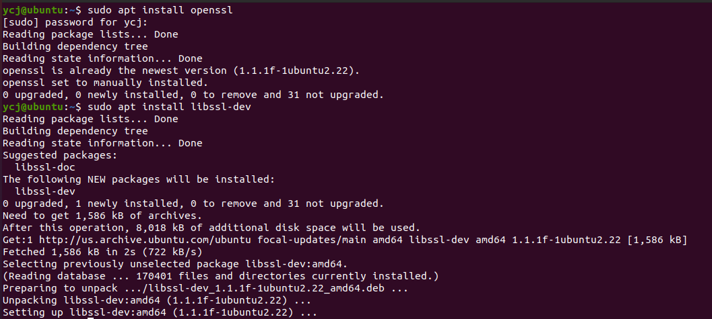
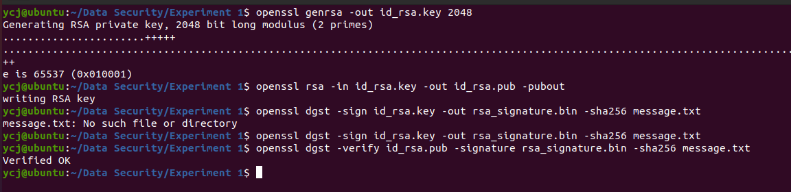

# 实验一：在 OpenSSL 中进行数据签名及验证


#### 姓名：于成俊

#### 学号：2112066

#### 专业：密码科学与技术


## 一、实验过程

### （1）在Ubuntu的命令行输入以下命令安装OpenSSL工具

- `sudo apt install openssl`：安装或更新 OpenSSL
- `sudo apt install libssl-dev`：安装 libssl-dev 包

运行如下：



### （2） 使用 OpenSSL 命令签名并验证

- 创建Data Security/Experiment 1文件夹，在这里做实验，防止干扰其他文件。

- 使用`openssl genrsa -out id_rsa.key 2048`命令生成 2048 位密钥，存储到文件 id_rsa.key
- 使用`openssl rsa -in id_rsa.key -out id_rsa.pub -pubout`命令根据私钥文件，导出公钥文件 id_rsa.pub
- 使用`openssl dgst -sign id_rsa.key -out rsa_signature.bin -sha256 message.txt`命令使用私钥对文件 message.txt 进行签名，输出签名到 message.sha256（注意，在此之前，需要创建message.txt，否则会出现No such file or directory的错误）
- 使用`openssl dgst -verify id_rsa.pub -signature rsa_signature.bin -sha256 message.txt`命令 使用公钥验证签名

运行如下：



若验证成功，会输出 Verified OK 字段。

### （3）编写数字签名程序

-  按照教材编写程序文件 signature.cpp，如下：

```C
#include <stdio.h>
#include <string.h>
#include <openssl/evp.h>
#include <openssl/rsa.h>
#include <openssl/pem.h>
// 公钥文件名
#define PUBLIC_KEY_FILE_NAME "public.pem"
// 私钥文件名
#define PRIVATE_KEY_FILE_NAME "private.pem"
// RSA 生成公私钥，存储到文件
bool genrsa(int numbit)
{
 EVP_PKEY_CTX *ctx = EVP_PKEY_CTX_new_id(EVP_PKEY_RSA, NULL);
 if (!ctx)
 return false;
 EVP_PKEY *pkey = NULL;
 bool ret = false;
 int rt;
 FILE *prif = NULL, *pubf = NULL;
 if (EVP_PKEY_keygen_init(ctx) <= 0)
 goto err;
 // 设置密钥长度
 if (EVP_PKEY_CTX_set_rsa_keygen_bits(ctx, numbit) <= 0)
 goto err;
 // 生成密钥
 if (EVP_PKEY_keygen(ctx, &pkey) <= 0)
 goto err;
 prif = fopen(PRIVATE_KEY_FILE_NAME, "w");
 if (!prif)
 goto err;
 // 输出私钥到文件
 rt = PEM_write_PrivateKey(prif, pkey, NULL, NULL, 0, NULL, NULL);
 fclose(prif);
 if (rt <= 0)
 goto err;
 pubf = fopen(PUBLIC_KEY_FILE_NAME, "w");
 if (!pubf)
 goto err;
 // 输出公钥到文件
 rt = PEM_write_PUBKEY(pubf, pkey);
 fclose(pubf);
 if (rt <= 0)
 goto err;
 ret = true;
err:
 EVP_PKEY_CTX_free(ctx);
 return ret;
}
// 生成数据签名
bool gensign(const uint8_t *in, unsigned int in_len, uint8_t *out, unsigned int *out_len)
{
 FILE *prif = fopen(PRIVATE_KEY_FILE_NAME, "r");
 if (!prif)
 return false;
 // 读取私钥
 EVP_PKEY *pkey = PEM_read_PrivateKey(prif, NULL, NULL, NULL);
 fclose(prif);
 if (!pkey)
 return false;
 bool ret = false;
 EVP_MD_CTX *ctx = EVP_MD_CTX_new();
 if (!ctx)
 goto ctx_new_err;
 // 初始化
 if (EVP_SignInit(ctx, EVP_sha256()) <= 0)
 goto sign_err;
 // 输入消息，计算摘要
 if (EVP_SignUpdate(ctx, in, in_len) <= 0)
 goto sign_err;
 // 生成签名
 if (EVP_SignFinal(ctx, out, out_len, pkey) <= 0)
 goto sign_err;
 ret = true;
sign_err:
 EVP_MD_CTX_free(ctx);
ctx_new_err:
 EVP_PKEY_free(pkey);
 return ret;
}
// 使用公钥验证数字签名，结构与签名相似
bool verify(const uint8_t *msg, unsigned int msg_len, const uint8_t *sign, unsigned int 
sign_len)
{
 FILE *pubf = fopen(PUBLIC_KEY_FILE_NAME, "r");
 if (!pubf)
 return false;
 // 读取公钥
 EVP_PKEY *pkey = PEM_read_PUBKEY(pubf, NULL, NULL, NULL);
 fclose(pubf);
 if (!pkey)
 return false;
 bool ret = false;
 EVP_MD_CTX *ctx = EVP_MD_CTX_new();
 if (!ctx)
 goto ctx_new_err;
 // 初始化
 if (EVP_VerifyInit(ctx, EVP_sha256()) <= 0)
 goto sign_err;
 // 输入消息，计算摘要
 if (EVP_VerifyUpdate(ctx, msg, msg_len) <= 0)
 goto sign_err;
 // 验证签名
 if (EVP_VerifyFinal(ctx, sign, sign_len, pkey) <= 0)
 goto sign_err;
 ret = true;
sign_err:
 EVP_MD_CTX_free(ctx);
ctx_new_err:
 EVP_PKEY_free(pkey);
 return ret;
}
int main()
{
 // 生成长度为 2048 的密钥
 genrsa(2048);
 const char *msg = "Hello World!";
 const unsigned int msg_len = strlen(msg);
 // 存储签名
 uint8_t sign[256] = {0};
 unsigned int sign_len = 0;
 // 签名
 if (!gensign((uint8_t *)msg, msg_len, sign, &sign_len))
 {
 printf("签名失败\n");
 return 0;
 }
 // 验证签名
 if (verify((uint8_t *)msg, msg_len, sign, sign_len))
 printf("验证成功\n");
 else
printf("验证失败\n");
 return 0;
}
```

- 使用`g++ signature.cpp -o signature -lcrypto`命令编译signature.cpp
- 使用`./signature`命令运行signature.cpp

运行如下：


本次实验到此已全部完成！

## 二、实验总结

### （1）本次实验学习了相关语法

- 语法：genrsa [options] numbits 

  | 选项    | 作用                 |
  | ------- | -------------------- |
  | -out    | 指定输出文件         |
  | numbits | 密钥长度，存在默认值 |

- 语法：rsa [options] 

  | 选项    | 作用         |
  | ------- | ------------ |
  | -in     | 指定输入文件 |
  | -out    | 指定输出文件 |
  | -pubout | 输出公钥     |

- 语法：dgst [options] [file...] 

  | 选项              | 作用                   |
  | ----------------- | ---------------------- |
  | -sign val         | 生成签名，同时指定私钥 |
  | -versify val      | 使用公钥验证签名       |
  | -prverify val     | 使用私钥验证签名       |
  | -out outfile      | 输出到文件             |
  | -signature infile | 指定签名文件           |
  | -sha256           | 使用 sha256 算法摘要   |
  | file              | 消息文件               |

### （2）学习了PKI的相关知识

- 公钥基础设施（PKI, Public Key Infrastructure），是一种遵循既定标准的密钥管理平台, 它能够为所有网络应用提供加密和数字签名等密码服务及所必需的密钥和证书管理体系， 简单来说，PKI 就是利用公钥理论和技术建立的提供安全服务的基础设施。 
- 数字证书是指在互联网通讯中标志通讯各方身份信息的一个数字认证，人们可以在网 上用它来识别对方的身份。在 PKI 体系中，建有证书管理机构 CA (Certificate Authority) 。 CA 中心的公钥是公开的，因此由 CA 中心签发的内容均可以验证。 
- 密钥的生存周期包括：密钥的产生和登记、密钥分发、密钥更新、密钥撤销、密钥销 毁等。在产生密钥后，公钥需要在 PKI 中登记，并通过 CA 中心的私钥签名后形成公钥证 书。由于 CA 中心的公钥公开，用户可以方便的对公钥证书进行验证，进而用户可以通过 公钥证书来互相交换自己的公钥。进而，PKI 作为安全基础设施，能够提供身份认证、数 据完整性、数据保密性、数据公正性、不可抵赖性和时间戳六种安全服务。
-  PKI 的应用非常广泛，其为网上金融、网上银行、网上证券、电子商务、电子政务等 网络中的数据交换提供了完备的安全服务功能。

### （3）学习了OpenSSL

OpenSSL 是一个强大的开源工具包，提供了用于安全通信的加密、解密、证书生成和管理等功能。它包含以下几个功能：

1. **加密和解密：** OpenSSL 提供了对称加密算法（如 AES、DES）、非对称加密算法（如 RSA、DSA）以及哈希函数（如 SHA-1、SHA-256）的支持。这些算法可以用于加密和解密数据，保护通信的安全性。
2. **数字证书：** OpenSSL 支持 X.509 标准的数字证书，这是一种用于认证和加密通信的常见标准。OpenSSL 可以用于生成自签名证书、签署证书请求（CSR）、创建 CA 证书等操作。
3. **SSL/TLS 协议：** OpenSSL 实现了 SSL/TLS 协议，是保护 Web 通信安全的关键技术之一。它提供了安全的数据传输和身份验证机制，被广泛应用于 Web 服务器、电子邮件服务器等网络服务中。
4. **证书颁发机构（CA）：** OpenSSL 可以用于创建和管理证书颁发机构（CA）。CA 是负责签发和管理数字证书的可信任实体，它们的证书被客户端用于验证服务器的身份和加密通信。
5. **证书吊销列表（CRL）：** CRL 是包含已经被吊销的证书序列号的列表，用于通知客户端哪些证书不再可信。OpenSSL 可以用于生成和更新 CRL，以保持证书的有效性。
6. **安全套接字（Secure Sockets）：** OpenSSL 提供了安全套接字接口，可以在应用程序中实现安全通信。通过 OpenSSL，应用程序可以使用 SSL/TLS 协议来加密数据传输。
7. **跨平台支持：** OpenSSL 可以在多个操作系统上运行，包括 Linux、Unix、Windows 等，具有很好的跨平台性。

