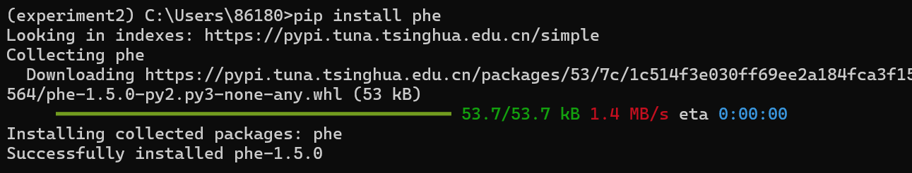
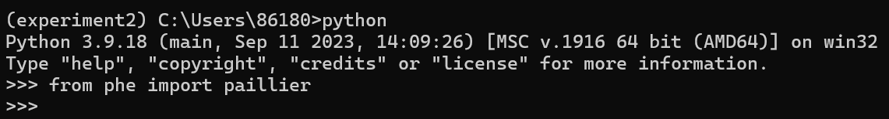
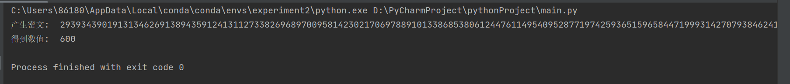
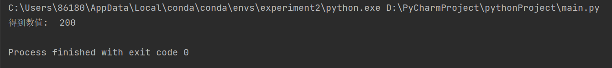

# 实验二：半同态加密应用实践(1)


#### 姓名：于成俊

#### 学号：2112066

#### 专业：密码科学与技术


## 一、实验内容

- 基础实验：基于Paillier算法实现隐私信息获取：从服务器给定的m个消息中获取其中一个，不得向服务器泄露获取了哪一个消息，同时客户端能完成获取消息的解密
- 扩展实验：在客户端保存对称密钥k，在服务器端存储m个用对称密钥k加密的密文，通过隐私信息获取方法得到指定密文后能解密得到对应的明文。


## 二、实验过程

### （1）实验环境安装

- 在Windows下安装Anaconda，这样就不用安装python了。

- 在命令行输入`conda create -n experiment2 python=3.9`，创建虚拟环境。

- 在命令行输入`activate experiment2`，启动虚拟环境

- 然后，输入命令`pip install phe`，安装phe库

  

- 输入`python`命令，进入python运行环境

- 输入`from phe import paillier`，导入phe库的paillier功能，若不出现错误信息，说明环境安装成功

  


### （2）基础实验

#### 1.使用PyCharm编写如下代码：

```python
# 导入包
from phe import paillier
import random

# 服务器端保存的数值
message_list = [100, 200, 300, 400, 500, 600, 700, 800, 900, 1000]
length = len(message_list)
# 客户端生成公私钥，选择读取的位置
public_key, private_key = paillier.generate_paillier_keypair()
pos = random.randint(0, length - 1)
# 客户端生成密文选择向量
select_list = []
enc_list = []
for i in range(length):
    select_list.append(i == pos)
    enc_list.append(public_key.encrypt(select_list[i]))

# 服务器端进行运算
c = 0
for i in range(length):
    c = c + message_list[i] * enc_list[i]
print("产生密文: ", c.ciphertext())
# 客户端进行解密
m = private_key.decrypt(c)
print("得到数值: ", m)
```

#### 2.运行如下：




### （3）扩展实验

#### 1.安装cryptography库

由于要用到对称加密算法，我使用了Fernet 对称加密算法，需要用到cryptography库，使用命令`pip install cryptography`进行安装

#### 2.编写如下代码

```python
from cryptography.fernet import Fernet  # 导入 Fernet 对称加密算法
from phe import paillier  # 导入 Paillier 加密算法库
import random  # 导入随机数生成模块

# 生成对称密钥的函数
def generate_key():
    return Fernet.generate_key()

# 对称加密函数，接收明文和对称密钥作为参数，返回密文
def encrypt_message(message, key):
    cipher = Fernet(key)
    return cipher.encrypt(message.encode())

# 对称解密函数，接收密文和对称密钥作为参数，返回明文
def decrypt_message(ciphertext, key):
    cipher = Fernet(key)
    return cipher.decrypt(ciphertext).decode()

# 生成 Paillier 公私钥对
public_key, private_key = paillier.generate_paillier_keypair()

# 服务器端保存的数值列表
message_list = [100, 200, 300, 400, 500, 600, 700, 800, 900, 1000]
length = len(message_list)

# 客户端生成对称密钥
k = generate_key()

# 客户端使用对称密钥加密数值，并发送给服务器端
encrypted_messages = []
for message in message_list:
    ciphertext = encrypt_message(str(message), k)
    encrypted_messages.append(ciphertext)

# 客户端随机选择读取的位置
pos = random.randint(0, length - 1)

# 服务器端根据客户端发送的加密数据进行解密
ciphertext = encrypted_messages[pos]
plaintext = decrypt_message(ciphertext, k)
print("得到数值: ", plaintext)

```

#### 3.运行如下：




## 三、实验总结

- 半同态加密是一种特殊的加密技术，允许在密文上执行某些特定的计算操作，而无需将其解密为明文。具体来说，半同态加密系统支持在加密状态下执行加法或乘法运算，但不能同时支持这两种运算。这种性质使得半同态加密在保护数据隐私的同时，仍然能够进行一定程度的计算。

  半同态加密系统的一个典型例子是 Paillier 加密算法。Paillier 加密算法具有以下特性：

  1. 加法同态性：给定两个密文 C1 和 C2，可以对它们进行加法运算得到一个新的密文 C3，该密文解密后的明文等于对应的两个明文之和。
  2. 乘法常量同态性：给定一个密文 C 和一个明文常量 k，可以对密文 C 进行乘法运算得到一个新的密文 C'，该密文解密后的明文等于对应明文的 k 倍。
  3. 乘法完整同态性：尽管 Paillier 加密算法本身并不支持乘法的完整同态性，但可以通过技巧实现在一定程度上对乘法的同态性。这通常涉及到将明文转换为密文，然后进行一系列的操作来模拟乘法运算。

  半同态加密可以在不泄露数据明文的情况下进行一些有用的计算，例如对加密数据进行求和、求平均值等。然而，由于其限制性质，它并不能执行所有的计算操作，因此在设计应用时需要考虑到其局限性。

- `paillier.generate_paillier_keypair()` 是 Paillier 加密算法库中的一个函数，用于生成 Paillier 加密算法的公钥和私钥对。具体来说，Paillier 加密算法是一种公钥加密算法，其安全性基于大整数分解问题。生成的公钥和私钥对用于加密和解密数据。公钥可以用于加密数据，而私钥用于解密加密的数据。

  在 `paillier.generate_paillier_keypair()` 函数中，系统会生成一个随机的大素数对 p 和 q，并计算 n = p * q。然后根据 n，生成公钥和私钥，其中公钥包含 n 的值，私钥则包含 p 和 q 的值。这样生成的公钥和私钥对具有一定的安全性，可以用于 Paillier 加密算法的加密和解密过程。

  在代码中，生成的公钥和私钥对被分别赋值给 `public_key` 和 `private_key` 变量，然后可以用于加密和解密数据。