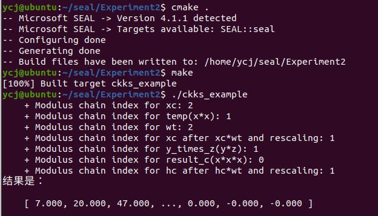

# 实验三：SEAL应用实践（1）


#### 姓名：于成俊

#### 学号：2112066

#### 专业：密码科学与技术


## 一、实验内容

参考教材实验2.3，实现将三个数的密文发送到服务器，完成$x^3+y*z$的运算


## 二、实验原理

### （1）CKKS算法

CKKS（Cheon-Kim-Kim-Song）是一种用于加密多项式近似计算的全同态加密方案，它在微软的 SEAL（Simple Encrypted Arithmetic Library）库中实现。CKKS 方案允许对实数和复数进行加密，并在加密状态下进行基本的算术运算，如加法和乘法，同时保持高度的安全性和计算效率。下面是 CKKS 算法的一些关键特点和步骤：

- **多项式近似：** CKKS 算法使用多项式近似来表示实数或复数。它将实数或复数转换为多项式形式，并且将多项式的系数存储在密文中。因为多项式是无限精度的，所以 CKKS 能够对实数或复数进行高精度的加密和计算。

- **参数设置：** CKKS 算法中有几个重要的参数需要设置，包括多项式模数、系数模数和规模。多项式模数决定了多项式的次数，系数模数决定了多项式系数的范围，规模决定了加密数据的精度。这些参数的选择需要平衡安全性和计算效率。

- **编码和加密：** 在使用 CKKS 算法加密实数或复数之前，需要先将其编码为多项式形式，然后使用加密密钥对多项式进行加密。编码过程涉及将实数或复数转换为多项式的系数，并且根据设置的规模进行放缩。

- **加法和乘法运算：** 加密状态下的加法和乘法运算是 CKKS 算法的核心。它能够在加密状态下对密文进行加法和乘法运算，并且保持计算结果的准确性和安全性。对于乘法运算，CKKS 算法需要进行重线性化（relinearization）和重调整（rescaling）操作，以保持密文的安全性和计算效率。

- **解密和解码：** 在进行计算后，可以使用解密密钥对密文进行解密，将其恢复为原始的实数或复数。解密后的结果需要进行解码操作，将多项式形式的系数转换回实数或复数形式。


### （2）标准化构建流程

CKKS算法由五个模块组成：密钥生成器keygenerator、加密模块encryptor、解密模块decryptor、密文计算模块evaluator和编码器encoder，其中编码器实现数据和环上元素的相互转换。

**依据这五个模块，构建同态加密应用的过程为：**

① 选择CKKS参数parms

② 生成CKKS框架context

③ 构建CKKS模块keygenerator、encoder、encryptor、evaluator和decryptor

④ 使用encoder将数据**n**编码为明文**m**

⑤ 使用encryptor将明文**m**加密为密文**c**

⑥ 使用evaluator对密文**c**运算为密文**c**’

⑦ 使用decryptor将密文**c**’解密为明文**m**’

⑧ 使用encoder将明文**m**’解码为数据**n**


## 三、实验过程

### （1）安装SEAL库

- 在Ubuntu的home文件夹下建立文件夹seal，进入该文件夹后，打开终端，输入命令：`git clone https://github.com/microsoft/SEAL`，运行完毕，将在seal文件夹下自动建立SEAL这个新文件夹。运行如下：

  

- 输入命令：`cd SEAL`，进入SEAL文件夹，然后输入命令：`cmake .`为项目设置构建环境，并准备好构建文件，显示如下，就说明运行成功

  

  

- 输入命令：`make`，完成项目的编译，显示如下，就说明运行成功

  

- 输入命令：`sudo make install`，完成项目的安装，显示如下，说明安装成功

  


### （2）编写代码

- 在SEAL文件夹同目录下，新建Experiment2文件夹，如下：

  

- 在Experiment2文件夹中，使用文本编辑器建立一个cpp文件ckks_example.cpp，代码内容如下：

  ```C++
  #include "examples.h"
  /*该文件可以在SEAL/native/example目录下找到*/
  #include <vector>
  using namespace std;
  using namespace seal;
  #define N 3
  //本例目的：给定x, y, z三个数的密文，让服务器计算x^3+y*z
  
  int main(){
  //初始化要计算的原始数据
  vector<double> x, y, z;
  	x = { 1.0, 2.0, 3.0 };
  	y = { 2.0, 3.0, 4.0 };
  	z = { 3.0, 4.0, 5.0 };
  
  vector<double> h;
          h = { 1.0, 1.0, 1.0 };
  /**********************************
  客户端的视角：生成参数、构建环境和生成密文
  ***********************************/
  //（1）构建参数容器 parms
  EncryptionParameters parms(scheme_type::ckks);
  /*CKKS有三个重要参数：
  1.poly_module_degree(多项式模数)
  2.coeff_modulus（参数模数）
  3.scale（规模）*/
  
  size_t poly_modulus_degree = 8192;
  parms.set_poly_modulus_degree(poly_modulus_degree);
  parms.set_coeff_modulus(CoeffModulus::Create(poly_modulus_degree, { 60, 40, 40, 60 }));
  //选用2^40进行编码
  double scale = pow(2.0, 40);
  
  //（2）用参数生成CKKS框架context 
  SEALContext context(parms);
  
  //（3）构建各模块
  //首先构建keygenerator，生成公钥、私钥 
  KeyGenerator keygen(context); 
  auto secret_key = keygen.secret_key();
  PublicKey public_key;
      keygen.create_public_key(public_key);
  
  //构建编码器，加密模块、运算器和解密模块
  //注意加密需要公钥pk；解密需要私钥sk；编码器需要scale
  	Encryptor encryptor(context, public_key);
  	Decryptor decryptor(context, secret_key);
  
  	CKKSEncoder encoder(context);
  //对向量x、y、z进行编码
  	Plaintext xp, yp, zp, hp;
  	encoder.encode(x, scale, xp);
  	encoder.encode(y, scale, yp);
  	encoder.encode(z, scale, zp);
  	encoder.encode(h, scale, hp);
  //对明文xp、yp、zp进行加密
  	Ciphertext xc, yc, zc, hc;
  	encryptor.encrypt(xp, xc);
  	encryptor.encrypt(yp, yc);
  	encryptor.encrypt(zp, zc);
  	encryptor.encrypt(hp, hc);
   
  
  //至此，客户端将pk、CKKS参数发送给服务器，服务器开始运算
  /**********************************
  服务器的视角：生成重线性密钥、构建环境和执行密文计算
  ***********************************/
  //生成重线性密钥和构建环境
  SEALContext context_server(parms);
      RelinKeys relin_keys;
      keygen.create_relin_keys(relin_keys);
  	Evaluator evaluator(context_server);  
  
  /*对密文进行计算，要说明的原则是：
  -加法可以连续运算，但乘法不能连续运算
  -密文乘法后要进行relinearize操作
  -执行乘法后要进行rescaling操作
  -进行运算的密文必需执行过相同次数的rescaling（位于相同level）*/ 
  	Ciphertext temp;
  	Ciphertext result_c;
  //计算x*x，密文相乘，要进行relinearize和rescaling操作 
  	evaluator.multiply(xc,xc,temp);
  	evaluator.relinearize_inplace(temp, relin_keys);
  	evaluator.rescale_to_next_inplace(temp);
  
  //在计算x*x * x之前，x没有进行过rescaling操作，所以需要对x进行一次乘法和rescaling操作，目的是使得x*x 和x在相同的层
  	Plaintext wt;
  	encoder.encode(1.0, scale, wt);
  
  //此时，我们可以查看框架中不同数据的层级：
  cout << "    + Modulus chain index for xc: "
  << context_server.get_context_data(xc.parms_id())->chain_index() << endl; 
  cout << "    + Modulus chain index for temp(x*x): "
  << context_server.get_context_data(temp.parms_id())->chain_index() << endl;
  cout << "    + Modulus chain index for wt: "
  << context_server.get_context_data(wt.parms_id())->chain_index() << endl;
  
  //执行乘法和rescaling操作：
  	evaluator.multiply_plain_inplace(xc, wt);
  	evaluator.rescale_to_next_inplace(xc);
  
  //再次查看xc的层级，可以发现xc与temp层级变得相同
  cout << "    + Modulus chain index for xc after xc*wt and rescaling: "
  << context_server.get_context_data(xc.parms_id())->chain_index() << endl;
  
  //最后执行temp（x*x）* xc（x*1.0）
  	evaluator.multiply_inplace(temp, xc);
  	evaluator.relinearize_inplace(temp,relin_keys);
  	evaluator.rescale_to_next(temp, result_c);
  
  //计算y*z
      Ciphertext y_times_z;
      evaluator.multiply(yc, zc, y_times_z);
      evaluator.relinearize_inplace(y_times_z, relin_keys);
      evaluator.rescale_to_next_inplace(y_times_z);
  
  cout << "    + Modulus chain index for y_times_z(y*z): "
  << context_server.get_context_data(y_times_z.parms_id())->chain_index() << endl;
  cout << "    + Modulus chain index for result_c(x*x*x): "
  << context_server.get_context_data(result_c.parms_id())->chain_index() << endl;
  
  
  //计算y*z*h h = { 1.0, 1.0, 1.0 };
  
  //执行乘法和rescaling操作：
  	evaluator.multiply_plain_inplace(hc, wt);
  	evaluator.rescale_to_next_inplace(hc);
  //查看hc的层级，可以发现hc与y_times_z层级变得相同
  cout << "    + Modulus chain index for hc after hc*wt and rescaling: "
  << context_server.get_context_data(hc.parms_id())->chain_index() << endl;
  
  //最后执行y_times_z（x*x）* hc（h*1.0）
  	Ciphertext result_d;
  	evaluator.multiply_inplace(y_times_z, hc);
  	evaluator.relinearize_inplace(y_times_z,relin_keys);
  	evaluator.rescale_to_next(y_times_z, result_d);
  	
  // 计算 x^3 + y * z
      Ciphertext result_end;
      evaluator.add(result_c, result_d, result_end);
      
  //计算完毕，服务器把结果发回客户端
  /**********************************
  客户端的视角：进行解密和解码
  ***********************************/
  //客户端进行解密
  	Plaintext result_p;
  	decryptor.decrypt(result_end, result_p);
  //注意要解码到一个向量上
  	vector<double> result;
  	encoder.decode(result_p, result);
  //得到结果，正确的话将输出：{7.000，20.000，47.000，...，0.000，0.000，0.000}
  	cout << "结果是：" << endl;
  	print_vector(result,3,3);
  return 0;
  }
  ```

  以上代码是在实验2.3的代码基础上进行更改，实验2.3是计算`x*y*z`，基于此就很容易计算`x^3=x*x*x`。此外，我又定义了新的向量`h = { 1.0, 1.0, 1.0 }`，所以，计算`y*z*h`就是计算`y*z`，这里多一次乘法的目的，是为了让两个结果处在同一“level”上，从而可以进行加法运算。

- 编写一个CMakeLists.txt文件，内容如下：

  ```c++
  cmake_minimum_required(VERSION 3.10) 
  project(Experiment2)
  add_executable(ckks_example ckks_example.cpp)
  add_compile_options(-std=c++17)
  
  find_package(SEAL)
  target_link_libraries(ckks_example SEAL::seal)
  ```

- 然后，将SEAL/native/examples中的examples.h文件复制到Experiment2文件夹中

- 编写完毕后，打开控制台，依次运行以下命令：

  - `cmake .`
  - `make`
  - `./ckks_example`

  运行如下：

  


## 四、实验总结

### （1）相关参数

学习了CKKS三个重要的参数：

- poly_module_degree（多项式模数）

  该参数必须是2的幂，如1024, 2048, 4096, 8192, 16384, 32768，当然再大点也没问题。

  更大的poly_modulus_degree会增加密文的尺寸，这会让计算变慢，但也能让你执行更复杂的计算

- coeff_modulus（参数模数）

  这是一组重要参数，因为rescaling操作依赖于coeff_modules。

  简单来说，coeff_modules的个数决定了你能进行rescaling的次数，进而决定了你能执行的乘法操作的次数。

  coeff_modules的最大位数与poly_modules有直接关系，列表如下：

  

  本文例子中的{60，40，40，60}有以下含义：

  ① coeff_modules总位长200（60+40+40+60）位

  ② 最多进行两次（两层）乘法操作

  该系列数字的选择不是随意的，有以下要求：

  ① 总位长不能超过上表限制

  ② 最后一个参数为特殊模数，其值应该与中间模数的最大值相等

  ③ 中间模数与scale尽量相近

  注意：如果将模数变大，则可以支持更多层级的乘法运算，比如poly_modulus为16384则可以支持coeff_modules= { 60, 40, 40, 40, 40, 40, 40, 60 }，也就是6层的运算。

- scale（规模）

  Encoder利用该参数对浮点数进行缩放，每次相乘后密文的scale都会翻倍，因此需要执行rescaling操作约减一部分，约模的大素数位长由coeff_modules中的参数决定。

  Scale不应太小，虽然大的scale会导致运算时间增加，但能确保噪声在约模的过程中被正确地舍去，同时不影响正确解密。 

  因此，两组推荐的参数为：

  Poly_module_degree = 8196; coeff_modulus={60,40,40,60};scale = 2^40

  Poly_module_degree = 8196; coeff_modulus={50,30,30,30.50};scale = 2^30 


### （2）注意事项

- 每次进行运算前，要保证参与运算的数据位于同一“level”上。加法不需要进行rescaling操作，因此不会改变数据的level。数据的level只能降低无法升高，所以要小心设计计算的先后顺序。

- 可以通过输出p.scale()、p.parms_id()以及context->get_context_data( p.parms_id() ) ->chain_index()来确认即将进行操作的数据满足如下计算条件：1）用同一组参数进行加密；2）位于（chain）上的同一level；3）scale相同。

- 要想把不同level的数据拉到同一level，可以利用乘法单位元1把层数较高的操作数拉到较低的level，也可以通过内置函数进行直接转换。
