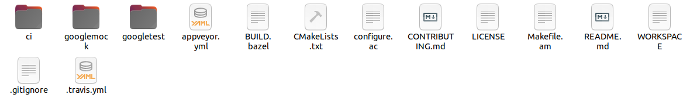

# 实验四：零知识证明实践


#### 姓名：于成俊

#### 学号：2112066

#### 专业：密码科学与技术


## 一、实验内容

参考教材实验3.1，假设Alice希望证明自己知道如下方程的解$x^3+x+5=out$，其中out是大家都知道的一个数，这里假设out为35，而x=3就是方程的解，请实现代码完成证明生成和证明的验证。


## 二、实验原理

### （1）简洁零知识证明zkSNARK

- zkSNARK(zero-knowledge Succinct Non-interactive Arguments of Knowledge)就是一类基于公共参考字符串CRS模型实现的典型的非交互式零知识证明技术。zkSNARK中比较典型的协议有Groth10、GGPR13、Pinocchio、GRoth6、GKMMM18等。

- CRS模型是在证明者构造证明之前由一个受信任的第三方产生的随机字符串，CRS必须由一个受信任的第三方来完成，同时共享给证明者和验证者。它其实就把挑战过程中所要生成的随机数和挑战数，都预先生成好，然后基于这些随机数和挑战数生成他们对应的在证明和验证过程中所需用到的各种同态隐藏。之后，就把这些随机数和挑战数销毁。这些随机数和挑战数被称为toxic waste（有毒废物），如果他们没有被销毁的话，就可以被用来伪造证明。

#### 1.技术特征

zkSNARK的命名几乎包含其所有技术特征：

- 简洁性：最终生成的证明具有简洁性，也就是说最终生成的证明足够小，并且与计算量大小无关。
- 无交互：没有或者只有很少的交互。对于zkSNARK来说，证明者向验证者发送一条信息之后几乎没有交互。此外，zkSNARK还常常拥有“公共验证者”的属性，意思是在没有再次交互的情况下任何人都可以验证。 
- 可靠性：证明者在不知道见证（Witness，私密的数据，只有证明者知道）的情况下，构造出证明是不可能的。
- 零知识：验证者无法获取证明者的任何隐私信息。

#### 2.开发步骤

应用zkSNARK技术实现一个非交互式零知识证明应用的开发步骤大体如下：

- 定义电路：将所要声明的内容的计算算法用算术电路来表示，简单地说，算术电路以变量或数字作为输入，并且允许使用加法、乘法两种运算来操作表达式。所有的NP问题都可以有效地转换为算术电路。
- 将电路表达为R1CS：在电路的基础上构造约束，也就是R1CS（Rank-Constraint System，一阶约束系统），有了约束就可以把NP问题抽象成QAP（Quadratic Arithmetic Problem）问题。RICS与QAP形式上的区别是QAP使用多项式来代替点积运算，而它们的实现逻辑完全相同。有了QAP问题的描述，就可以构建zkSNARKs。
- 完成应用开发：
  - 生成密钥：生成证明密钥（Proving Key）和验证密钥（Verification Key）；
  - 生成证明：证明方使用证明密钥和其可行解构造证明；
  - 验证证明：验证方使用验证密钥验证证明方发过来的证明。

基于zkSNARK的实际应用，最终实现的效果就是证明者给验证者一段简短的证明，验证者可以自行校验某命题是否成立。


### （2）流程

本次实验使用libsnark库完成证明生成和证明的验证的流程如下：


## 三、实验过程

### （1）安装libsnark库

- 创建名为Libsnark的文件夹

- 打开https://github.com/sec-bit/libsnark_abc，点击“Code”、“Download ZIP”，下载后解压到Libsnark文件夹，得到~/Libsnark/libsnark_abc-master

- 打开https://github.com/scipr-lab/libsnark，点击“Code”、“Download ZIP”，下载解压后，将其中文件复制到~/Libsnark/libsnark_abc-master/depends/libsnark文件夹内

- 打开https://github.com/scipr-lab/libsnark，点击“depends”，可以看到六个子模块的链接地址

  

- 分别点击这六个链接并下载解压，得到如下六个文件夹，为方便下文表述，分别将这六个文件夹命名为Libfqfft、Libff、Gtest、Xbyak、Ate-pairing、Libsnark-supercop。

  

- 重新命名后，如下：

  

- 我的Ubuntu的版本是20.04.6 LTS，所以运行这个命令`sudo apt install build-essential cmake git libgmp3-dev libprocps-dev python3-markdown libboost-program-options-dev libssl-dev python3 pkg-config`，运行如下：

  

- 安装子模块`xbyak`，将下载得到的文件夹Xbyak内的文件复制到~/Libsnark/libsnark_abc-master/depends/libsnark/depends/xbyak，并在该目录下打开终端，执行命令`sudo make install`，出现下面界面，说明安装成功。

  

- 安装子模块ate-pairing，将下载得到的文件夹Ate-pairing内的文件复制到~/Libsnark/libsnark_abc-master/depends/libsnark/depends/ate-pairing，并在该目录下打开终端，执行以下命令：

  - `make -j`
  - `test/bn`

  执行make -j最后几行如下：

  

  执行test/bn最后几行如下：

  

- 安装子模块libsnark-supercop，将下载得到的文件夹Libsnark-supercop内的文件复制到~/Libsnark/libsnark_abc-master/depends/libsnark/depends/libsnark-supercop，并在该目录下打开终端，执行命令`./do`，出现以下界面，说明安装成功

  

- 安装子模块gtest，将下载得到的文件夹Gtest内的文件复制到~/Libsnark/libsnark_abc-master/depends/libsnark/depends/gtest

  

- 安装子模块libff，将下载得到的文件夹Libff内的文件复制到~/Libsnark/libsnark_abc-master/depends/libsnark/depends/libff。点击libff->depends，可以看到一个ate-pairing文件夹和一个xbyak文件夹，这是libff需要的依赖项。打开这两个文件夹，会发现它们是空的，这时候需要将下载得到的Ate-pairing和Xbyak内的文件复制到这两个文件夹下。然后，在~/Libsnark/libsnark_abc-master/depends/libsnark/depends/libff下打开终端，执行命令:

  - `mkdir build`
  - `cd build`
  - `cmake ..`
  - `make`
  - `sudo make install`

  安装完之后检测是否安装成功，执行命令`make check`，如下图所示则安装成功：

  

- 安装子模块libfqfft，将下载得到的文件夹Libfqfft内的文件复制到~/Libsnark/libsnark_abc-master/depends/libsnark/depends/libfqfft。点击libfqfft->depends，可以看到libfqfft有四个依赖项，分别是ate-pairing、gtest、libff、xbyak，点开来依然是空的。和上一步一样，将下载得到的文件夹内文件复制到对应文件夹下。注意libff里还有depends文件夹，里面的ate-pairing和xbyaky也是空的，需要将下载得到的airing和Xbyak文件夹内的文件复制进去。然后，在~/Libsnark/libsnark_abc-master/depends/libsnark/depends/libfqfft下打开终端，执行以下命令：

  - `mkdir build`
  - `cd build`
  - `cmake ..`
  - `make`
  - `sudo make install`

  安装完之后检测是否安装成功，执行命令`make check`，如下图所示则安装成功：

  

- libsnark编译安装：在~/Libsnark/libsnark_abc-master/depends/libsnark下打开终端，执行以下命令：

  - `mkdir build`
  - `cd build`
  - `cmake ..`
  - `make`
  - `make check`

  如下图所示则安装成功：

  

-  整体编译安装：在~/Libsnark/libsnark_abc-master下打开终端，执行以下命令：

  - `mkdir build`
  - `cd build`
  - `cmake ..`
  - `make`

- 运行代码：执行命令`./src/test`，最终出现如下日志，则说明你已顺利拥有了zkSNARK应用开发环境，并成功跑了第一个zk-SNARKs的demo。

  

  

### （2）编写代码

- 我们先要将待证明的命题表达为R1CS，才能编写代码。因为x=3，所以可用`x-3=0`来约束它，然后可将其拍成如下两个等式
  - $w_1 = x-3$
  - $out = w_1*1$

- 在~/Libsnark/libsnark_abc-master/src下打开终端，输入如下命令，创建common.hpp、mysetup.cpp、myprove.cpp、myverify.cpp文件

  - `touch common.hpp`
  - `touch mysetup.cpp`
  - `touch myprove.cpp`
  - `touch myverify.cpp`

- 然后，使用原型板protoboard搭建电路。将待证明的命题用电路表示，并用R1CS描述电路之后，就可以构建一个protoboard。protoboard，也就是原型板或者面包板，可以用来快速搭建算术电路，把所有变量、组件和约束关联起来。因为在初始设置、证明、验证三个阶段都需要构造面包板，所以这里将下面的代码放在一个公用的文件common.hpp中供三个阶段使用。

  ```C++
  //代码开头引用了三个头文件：第一个头文件是为了引入 default_r1cs_gg_ppzksnark_pp 类型；第二个则为了引入证明相关的各个接口；pb_variable 则是用来定义电路相关的变量。
  #include <libsnark/common/default_types/r1cs_gg_ppzksnark_pp.hpp>
  #include <libsnark/zk_proof_systems/ppzksnark/r1cs_gg_ppzksnark/r1cs_gg_ppzksnark.hpp>
  #include <libsnark/gadgetlib1/pb_variable.hpp>
  using namespace libsnark;
  using namespace std;
  //定义使用的有限域
  typedef libff::Fr<default_r1cs_gg_ppzksnark_pp> FieldT;
  //定义创建面包板的函数
  protoboard<FieldT> build_protoboard(int* secret)
  {
  	//初始化曲线参数
  	default_r1cs_gg_ppzksnark_pp::init_public_params();
  	//创建面包板
  	protoboard<FieldT> pb;
  	//定义所有需要外部输入的变量以及中间变量
  	pb_variable<FieldT> x;
      pb_variable<FieldT> w_1;
      pb_variable<FieldT> out;
  	//下面将各个变量与protoboard连接，相当于把各个元器件插到“面包板”上。allocate()函数的第二个string类型变量仅是用来方便DEBUG时的注释，方便DEBUG时查看日志。
  	out.allocate(pb, "out");
  	x.allocate(pb, "x");
  	w_1.allocate(pb, "w_1");
  	//定义公有的变量的数量，set_input_sizes(n)用来声明与protoboard连接的public变量的个数n。在这里n=1，表明与pb连接的前n = 1个变量是public的，其余都是private的。因此，要将public的变量先与pb连接（前面out是公开的）。
  	pb.set_input_sizes(1);
  	//为公有变量赋值
  	pb.val(out)=0;	
  	//至此，所有变量都已经顺利与protoboard相连，下面需要确定的是这些变量间的约束关系。如下调用protoboard 的add_r1cs_constraint()函数，为pb添加形如a * b = c的r1cs_constraint。即r1cs_constraint<FieldT>(a, b, c)中参数应该满足a * b = c。根据注释不难理解每个等式和约束之间的关系。
      // x-3= w_1
  	pb.add_r1cs_constraint(r1cs_constraint<FieldT>(x-3, 1, w_1));
  	//w_1*1=out
  	pb.add_r1cs_constraint(r1cs_constraint<FieldT>(w_1, 1, out));
  
  	//证明者在生成证明阶段传入私密输入，为私密变量赋值，其他阶段为NULL
  	if (secret!=NULL)
  	{
  		pb.val(x)=secret[0];
  		pb.val(w_1)=secret[1];
  	}
  	return pb;
  }
  ```

  以上代码是在实验3.1的代码基础上进行更改，**在定义变量和确定变量间的约束关系部分**只保留x、w_1和out，其他变量都删去。至此，针对命题的电路已构建完毕。

- 接下来，是生成公钥的初始设置阶段（Trusted Setup）。在这个阶段，我们使用生成算法为该命题生成公共参数（证明密钥和验证密钥），并把生成的证明密钥和验证密钥输出到对应文件中保存。其中，证明密钥供证明者使用，验证密钥供验证者使用。编写代码如下，将这段代码放在mysetup.cpp中。

  ```c++
  #include <libsnark/common/default_types/r1cs_gg_ppzksnark_pp.hpp>
  #include <libsnark/zk_proof_systems/ppzksnark/r1cs_gg_ppzksnark/r1cs_gg_ppzksnark.hpp>
  #include <fstream>
  #include "common.hpp"
  
  using namespace libsnark;
  using namespace std;
  
  int main()
  {
  	//构造面包板
  	protoboard<FieldT> pb=build_protoboard(NULL);
  	const r1cs_constraint_system<FieldT> constraint_system = pb.get_constraint_system();
  	//生成证明密钥和验证密钥
      const r1cs_gg_ppzksnark_keypair<default_r1cs_gg_ppzksnark_pp> keypair = r1cs_gg_ppzksnark_generator<default_r1cs_gg_ppzksnark_pp>(constraint_system);
  	//保存证明密钥到文件pk.raw
  	fstream pk("pk.raw",ios_base::out);
  	pk<<keypair.pk;
  	pk.close();
  	//保存验证密钥到文件vk.raw
  	fstream vk("vk.raw",ios_base::out);
  	vk<<keypair.vk;
  	vk.close();
  
  	return 0;
  }
  ```

- 在定义面包板时，我们已为public input提供具体数值，在构造证明阶段，证明者只需为private input提供具体数值。再把public input以及private input的数值传给prover函数生成证明。生成的证明保存到proof.raw文件中供验证者使用。编写代码如下，将这段代码放在myprove.cpp中。

  ```C++
  #include <libsnark/common/default_types/r1cs_gg_ppzksnark_pp.hpp>
  #include <libsnark/zk_proof_systems/ppzksnark/r1cs_gg_ppzksnark/r1cs_gg_ppzksnark.hpp>
  #include <fstream>
  #include "common.hpp"
  using namespace libsnark;
  using namespace std;
  int main()
  {
  	//输入秘密值x
  	int x;	
  	cin>>x;
  	//为私密输入提供具体数值
  	int secret[2];
  	secret[0]=x;
  	secret[1]=x-3;
  	//构造面包板
  	protoboard<FieldT> pb=build_protoboard(secret);
  	const r1cs_constraint_system<FieldT> constraint_system = pb.get_constraint_system();
  	cout<<"公有输入："<<pb.primary_input()<<endl;
  	cout<<"私密输入："<<pb.auxiliary_input()<<endl;
  	//加载证明密钥
  	fstream f_pk("pk.raw",ios_base::in);
  	r1cs_gg_ppzksnark_proving_key<libff::default_ec_pp>pk;
  	f_pk>>pk;
  	f_pk.close();
  	//生成证明
  	const r1cs_gg_ppzksnark_proof<default_r1cs_gg_ppzksnark_pp> proof = r1cs_gg_ppzksnark_prover<default_r1cs_gg_ppzksnark_pp>(pk, pb.primary_input(), pb.auxiliary_input());
  	//将生成的证明保存到proof.raw文件
  	fstream pr("proof.raw",ios_base::out);
  	pr<<proof;
  	pr.close();
  	return 0;
  } 
  ```

  以上代码是在实验3.1的代码基础上进行更改，在**为私密输入提供具体数值部分**只保留secret[0]和secret[1]，其他都删去。

- 最后我们使用verifier函数校验证明。如果verified = 1则说明证明验证成功。编写代码如下，将这段代码放在myverify.cpp中。

  ```C++
  #include <libsnark/common/default_types/r1cs_gg_ppzksnark_pp.hpp>
  #include <libsnark/zk_proof_systems/ppzksnark/r1cs_gg_ppzksnark/r1cs_gg_ppzksnark.hpp>
  #include <fstream>
  #include "common.hpp"
  using namespace libsnark;
  using namespace std;
  int main()
  {
  	//构造面包板
  	protoboard<FieldT> pb=build_protoboard(NULL);
  	const r1cs_constraint_system<FieldT> constraint_system = pb.get_constraint_system();
  	//加载验证密钥
  	fstream f_vk("vk.raw",ios_base::in);
  	r1cs_gg_ppzksnark_verification_key<libff::default_ec_pp>vk;
  	f_vk>>vk;
  	f_vk.close();
  	//加载银行生成的证明
  	fstream f_proof("proof.raw",ios_base::in);
  	r1cs_gg_ppzksnark_proof<libff::default_ec_pp>proof;
  	f_proof>>proof;
  	f_proof.close();
  	//进行验证
  	bool verified = r1cs_gg_ppzksnark_verifier_strong_IC<default_r1cs_gg_ppzksnark_pp>(vk, pb.primary_input(), proof);
  	cout<<"验证结果:"<<verified<<endl;
      return 0;
  }
  ```

- 打开~/Libsnark/libsnark_abc-master/src目录下的CMakeLists.txt文件，将如下代码复制到文件末尾。

  ```c++
  add_executable(
    mysetup
    mysetup.cpp
  )
  target_link_libraries(
    mysetup
    snark
  )
  target_include_directories(
    mysetup
  PUBLIC
    ${DEPENDS_DIR}/libsnark
    ${DEPENDS_DIR}/libsnark/depends/libfqfft
  )
  
  add_executable(
    myprove
    myprove.cpp
  )
  target_link_libraries(
    myprove
    snark
  )
  target_include_directories(
    myprove
    PUBLIC
    ${DEPENDS_DIR}/libsnark
    ${DEPENDS_DIR}/libsnark/depends/libfqfft
  )
  
  
  add_executable(
    myverify
    myverify.cpp
  )
  target_link_libraries(
    myverify
    snark
  )
  target_include_directories(
    myverify
    PUBLIC
    ${DEPENDS_DIR}/libsnark
    ${DEPENDS_DIR}/libsnark/depends/libfqfft
  )
  ```

- 在~/Libsnark/libsnark_abc-master/build下打开终端，执行以下命令：

  - `cmake ..`

  - `make`

  - `cd src`

  - `./mysetup`

  - `./myprove`

  - `3`

    

  - `./myverify`

- 运行结果如下：验证结果为1，表示x=3在取值范围内。

  

  

  


## 四、实验总结

- **深入理解零知识证明：** 通过实验，我更深入地理解了零知识证明的概念和原理。了解到如何使用 zkSNARK 协议构建零知识证明系统，以及如何利用这些技术来证明某些事实而不暴露相关的私密信息。

- **掌握libsnark库的使用：** 实验中使用了 libsnark 库，这是一个功能强大的开源库，用于实现零知识证明系统。通过实验，我学会了如何使用 libsnark 库来构建和验证零知识证明系统，包括生成证明和验证证明的过程。

总的来说，进行 zkSNARK 实验是一次非常有意义的学习和探索之旅，我从中收获了很多知识和经验，也对密码学和隐私保护有了更深入的理解。我期待着在未来的学习和实践中继续深入探索这个领域，并将所学应用到实际中去。