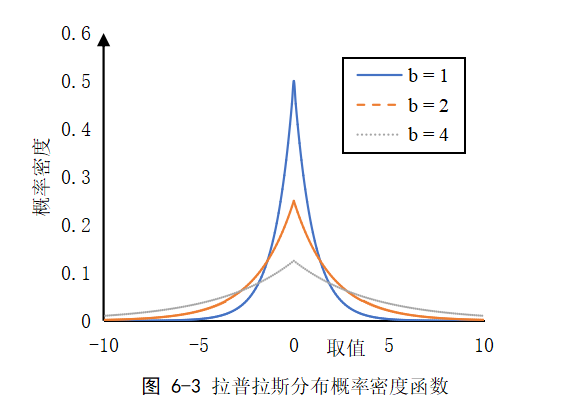
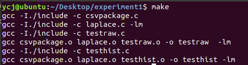
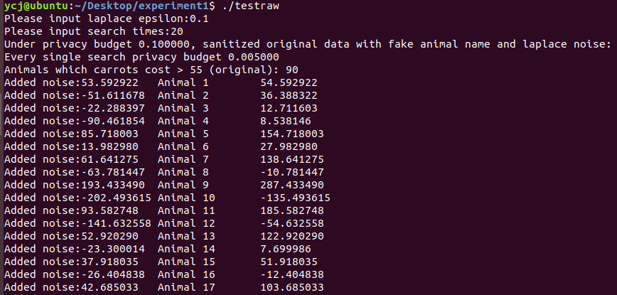
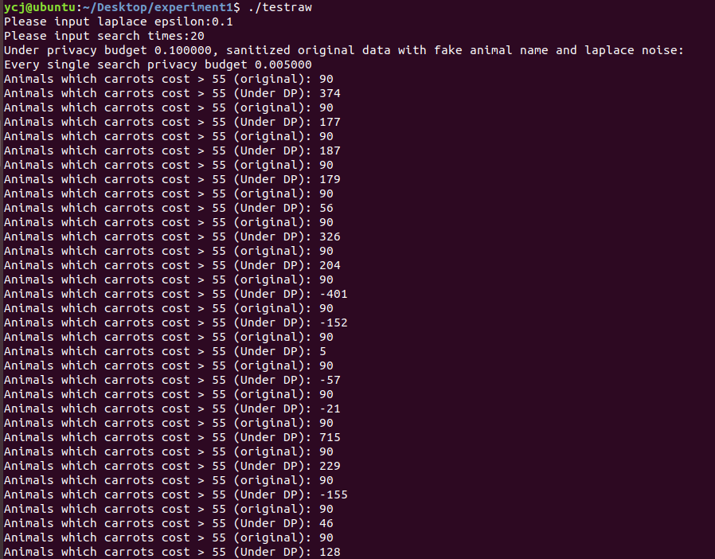
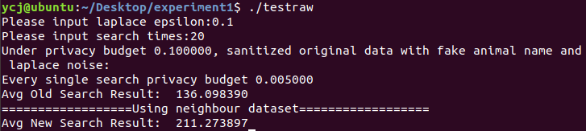
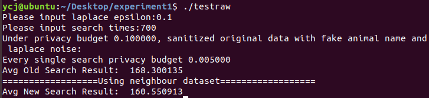
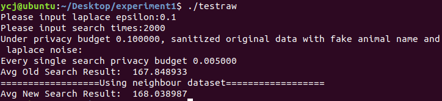
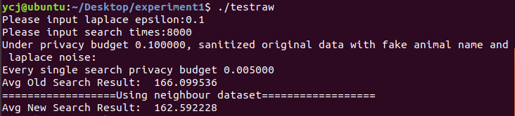
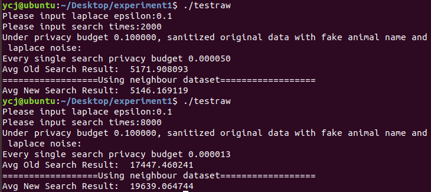

# 实验五：交互式发布DP方案评估


#### 姓名：于成俊

#### 学号：2112066

#### 专业：密码科学与技术


## 一、实验内容

参考教材实验5.1，对交互式发布方案进行DP方案设计，指定隐私预算为0.1，支持查询次数为20次，对DP发布后的结果进行评估说明隐私保护的效果。


## 二、实验原理

### 拉普拉斯机制

#### 1.全局灵敏度

设有查询函数$f:X^n->R^d$，输入为一个数据集，输出为d维实数向量。对于任意相邻数据集$D$和$D'\in X^n$，则 $GS_f = \max\limits_{D,D'} |\big|f(D)-f(D')\big||_p$，称为函数$f$的全局灵敏度。其中$|\big|f(D)-f(D')\big||_p$是$f(D)$和$f(D')$之间的$p$-阶范数距离，记为$l_p$灵敏度。对于不同的机制，灵敏度的范数也不同，拉普拉斯机制使用1阶范数距离（即曼哈顿距离），而高斯机制采用二阶范数（即欧几里得距离），具体取决于对应机制的隐私分析方法。 

#### 2.拉普拉斯分布

位置参数为0的拉普拉斯分布的概率密度函数如图6-3所示，其中横轴表示随机变量$x$的取值，纵轴表示相对应的概率密度，$b$是拉普拉斯分布的尺度参数。我们可以看到，拉普拉斯分布的特点是当$x=0$时，概率密度最大；而在两侧，其概率密度呈指数型下降，特别地，在分布任意一侧中，相同间隔的概率密度比值均相同。拉普拉斯机制通过向查询结果或原始数据加入服从拉普拉斯分布的噪声来实现差分隐私。




#### 3.拉普拉斯机制

我们使用$Lap(b)$来表示位置参数为0、尺度参数为$b$的拉普拉斯分布，$Lap(x|b)$表示在尺度参数为$b$的时候输出结果为x的概率，即概率密度函数，表示为：$Lap(x|b)=\frac{1}{2b}exp(-\frac{|x|}{b})$，根据差分隐私的理论，在灵敏度为1的时候，加入的噪声参数满足b为$\frac{1}{\varepsilon}$，即能满足$\varepsilon-$差分隐私。

设函数$f:X^n->R^k$，$ \triangle f=\max\limits_{D,D'} |\big|f(D)-f(D')\big||_1$为关于函数$f$的$l_1$灵敏度。给定数据集$D \in X^n$，则随机算法$M(D)=f(D)+(Y_1,...,Y_k),Y_i \textasciitilde Lap(\triangle f / \varepsilon) $提供$\varepsilon -$差分隐私。其中$Y_i$是独立同分布的，服从尺度参数$b$为$\triangle f / \varepsilon $的拉普拉斯分布的随机变量。这就是**拉普拉斯机制**。


## 三、实验环境

- 系统：Ubuntu 18.04
- 语言：C


## 四、实验过程

### （1）生成拉普拉斯噪声

为了实现拉普拉斯机制的加噪过程，首先，我们需要能够产生服从于拉普拉斯分布的噪音。具体来说，我们利用了产生随机变量的组合方法来产生这个噪音。该定理可以描述如下：

- 若随机变量$\xi $服从于离散分布$\left\{p_i\right\}$，即$P(\xi=i)=p_i$，同时有$z$服从于$F_\xi(x)$，取$z=x$，则有$z \textasciitilde F(x) = \sum_{i=1}^{K}p_iF_i(x)$，根据该定理，我们可以得到一个产生符合特定分布的随机数的组合算法：

  - （1）产生一个正随机数$\xi $，使得$P(\xi=i)=p_i$，$(i=1,2,3,...,K)$;
  - （2）在$\xi = i$时，产生具有分布函数$F_i(x)$的随机变量$x$

  该算法首先以概率$p_i$来选择一个子分布函数$F_i(x)$，然后取$F_i(x)$的随机数来作为$F(x)$的随机数。而具体到拉普拉斯机制而言，如前文所述，由于其概率密度分布函数为：$f(x/\beta)=\frac{1}{2\beta}e^{-\frac{|x|}{\beta}}$，其均值为0，方差为$2\beta^2$。基于前述的组合算法，我们得到产生拉普拉斯随机数的方法如下：

  - （1）首先，产生均匀分布的随机数$u_1$和$u_2$，即$u_1,u_2 \textasciitilde U(0,1)$；

  - （2）计算

    其中，$x/\beta$为拉普拉斯机制的隐私参数。在本例中，由于数据集的敏感度为1，其值为$1/\varepsilon$

代码如下：

```C
#include "laplace.h"
#include <stdint.h>
#include "string.h"
#include "stdio.h"
#include <math.h>
 
/* 
函数功能：	利用混合同余法产生（a,b）区间上均匀分布的随机数
输入参数说明：
a		给定区间的下限
b		给定区间的上限
seed	长整型指针变量， *seed 为伪随机数的种子
*/
double uniform_data(double a, double b,long int * seed)
{
	double t;
	*seed = 2045.0 * (*seed) + 1;
	*seed = *seed - (*seed / 1048576) * 1048576;
	t = (*seed) / 1048576.0;
	t = a + (b - a) * t;
	return t;
}

/*
函数功能：	求解laplace分布概率累积的反函数，利用该反函数产生laplace分布的随机数
输入参数说明：
beta		拉普拉斯分布参数
seed	    长整型指针变量， *seed 为伪随机数的种子
*/
double laplace_data(double beta, long int * seed)
{
	double u1,u2, x;
	u1 = uniform_data(0.0, 1.0, seed);
	u2 = uniform_data(0.0, 1.0, seed);
	if (u1 < 0.5)
	{
		x = beta * (log(2*u1)+u2);
	}
	else
	{
		x = u2 - (beta * log(2*(1-u1)));
	}
	
	return x;
}
```

- 函数`uniform_data`给出了一个生成服从均匀分布$U(0,1)$的随机数的算法。该算法利用从主函数中获取的随机数种子seed和区间上界$a$及下界$b$作为输入。首先，它利用线性同余法来对随机种子进行处理，从而生成一个随机数$t$，进一步地，我们将$t$映射到区间$(a,b)$上，就完成了一个服从$U(a,b)$的随机数生成。


- 函数laplace_data以隐私预算$\beta$和随机数种子seed作为输入，生成一个服从拉普拉斯分布的随机数。该算法首先调用uniform_data函数产生两个服从$U(0,1)$的随机数。之后，将这两个随机数代入到此前的公式中，这样，我们就可以得到一个以隐私参数$\beta$和随机种子seed生成的服从拉普拉斯分布的随机数了。


### （2）对交互式发布方案进行DP方案设计

在原始的testraw.c文件上进行修改：

- 对`csv_analysis()`函数进行修改：

  我将函数的返回类型改为了**double**，并且直接在结果上添加了 Laplace 噪声，而不是在原来的数据集上进行噪声添加了。

  ```c
  double csv_analysis(char* path, double beta, long int seed)
  {
  	FILE *original_file = fopen(path,"r+"); //读取指定路径的数据集
  	struct Animals * original_data = NULL;
  	original_data = csv_parser(original_file);
  	int sum=0,i=0;
  	double x = 0;
  	while(original_data[i].name)  //循环为原始数据集内各条数据去除标识（动物名）、生成拉普拉斯噪音并加噪
  	{
  		x = laplace_data(beta,&seed); //产生拉普拉斯随机数
  		printf("Added noise:%f\t%s %d\t%f\n",x,"Animal",i+1,original_data[i].carrots+x); //此处分别列出了每条具体添加的噪音和加噪的结果。当投入较少预算时，可能会出现负数
  		if(original_data[i].carrots+x>=55)
  		{
  			sum++;
  		}
  		i++;
  	}
  	printf("Animals which carrots cost > 55 (Under DP): %d\n",sum+(int)x); //输出加噪后的数据集中，每日食用胡萝卜大于55的动物个数
  	return sum+x;
  }
  ```

- 对主函数**main()**的修改：

  我在主函数中增加了查询次数的设置，也对多次查询取平均值的结果做了一定的统计工作。

  ```C
  int main()
  {
  	long int seed;
  	int sen = 1;  //对于一个单属性的数据集，其敏感度为1
  	double beta;
  	srand((unsigned)time( NULL )); //生成基于时间的随机种子（srand方法）
  	beta = 0;
  	printf("Please input laplace epsilon:");
  	scanf("%lf", &beta);
  	if(beta<=0 || !beta)//当输入的beta值无效时，默认设定beta值为1
  	{
  		beta = 1.0;
  	} 
  	long int search_times;
  	printf("Please input search times:");
  	scanf("%ld", &search_times);
  	
  	printf("Under privacy budget %f, sanitized original data with fake animal name and laplace noise:\n",beta);
  	printf("Every single search privacy budget %f\n", beta/20);
  	beta = sen / (beta/20); //拉普拉斯机制下，实际公式的算子beta为敏感度/预算
  	double avg_old=0;
  	for(int i=0;i<search_times;i++){
  		seed = rand()%10000+10000; //随机种子产生
  		avg_old+=csv_analysis("./zoo.csv",beta,seed); //先调用原始数据集
  	}
  	printf("Avg Old Search Result: \t%f\n", avg_old/search_times);
  	printf("==================Using neighbour dataset==================\n");
  	double avg_new=0;
  	for(int i=0;i<search_times;i++){
  		seed = rand()%10000+10000; //随机种子更新
  		avg_new+=csv_analysis("./zoo_nb.csv",beta,seed); //再调用相邻数据集
  	}
  	printf("Avg New Search Result: \t%f\n", avg_new/search_times);
  	return 0;
  }
  ```

  

## 五、实验结果

- 使用`make`命令进行编译：

  

- 输入./testraw命令来运行程序，并将隐私预算设置为0.1，支持查询次数设置为20次：

  

- 注释掉其他输出，观察原始结果和加入噪声后的结果，可以非常明显的看到隐私保护的效果，因为原始结果和加入噪声后的结果有着很大差异：

  

  也可以看出，当 *ϵ*= 0.1, k = 20 时，拉普拉斯分布的方差非常大，此时的噪声会特别大，因此数据的可用性也很差！

- 注释掉其他输出，查看平均值：

  

  可以看出有着很大不同，此时抗攻击效果很好。也就是说，即使取平均进行重复攻击，数据也被很好地保护了，没有泄露隐私信息。

- 接下来，我又尝试了一下当隐私预算被耗尽时结果会如何：

  - 查询次数设为700：

    

  - 查询次数设为2000：

    

  - 查询次数设为8000：

    

最后我们可以看到，当大量重复查询后，隐私预算被消耗殆尽，此时平均值会落在一个 160-170的区间之内，这是一个危险区间！这时已经可以认定隐私泄露了！

- 当然，如果隐私预算设置得非常充足（达到理论最好的值），那么就不会有这个问题。

  将下面的代码的进行更改：

  ```C
  printf("Every single search privacy budget %f\n", beta/20);
  beta = sen / (beta/20); //拉普拉斯机制下，实际公式的算子beta为敏感度/预算
  ```

  更改为：

  ```c
  printf("Every single search privacy budget %f\n", beta/search_times);
  beta = sen / (beta/search_times); //拉普拉斯机制下，实际公式的算子beta为敏感度/预算
  ```

  分别将查询次数设为2000和8000，结果如下：

  

  可以明显看出，平均值根本不会出现在一个区间之内，那么隐私信息也就不会有任何泄露了。


## 六、实验总结

在处理交互式数据库查询时，我们必须高度重视隐私保护，尤其是防止隐私泄露的风险。一种常见且实用的技术是通过添加随机噪音来保护查询的隐私。其中，拉普拉斯机制是一种行之有效的策略，它通过向查询结果添加自适应噪音来保护数据隐私。这种机制不仅可以有效地保护数据隐私，而且操作简单快捷，易于实现。

在我们的实验中，我们使用了一个实现隐私预算的拉普拉斯机制的程序。该程序首先读取指定路径的数据集，然后遍历数据集中的每个元素，对每个元素加上符合拉普拉斯分布的随机数，从而实现对原始数据集的加噪处理。在这个过程中，每条数据的信息都被拉普拉斯噪声所掩盖，从而达到了保护数据隐私的目的。

为了保证查询结果的准确性，我们需要使用随机生成的种子，以确保噪音的随机性。同时，我们还需要根据预算和敏感度计算出拉普拉斯机制需要的实际参数，以提高机制的效率和准确性。

此外，我们还发现，通过这种方式，我们可以在保护隐私的同时，保持数据的实用性。虽然加入的噪音会对数据的准确性产生一定影响，但是通过合理的参数设置，我们可以在保护隐私和保持数据实用性之间找到一个平衡点。

总的来说，这次实验让我们更深入地理解了隐私保护的重要性和挑战，也让我们看到了拉普拉斯机制在隐私保护中的强大作用。我们期待在未来的研究中，能够探索出更多的隐私保护技术，为保护用户隐私做出更大的贡献。

​              
