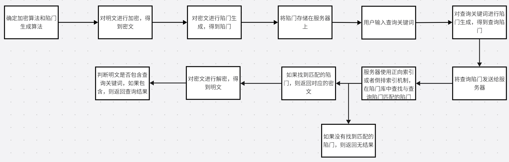
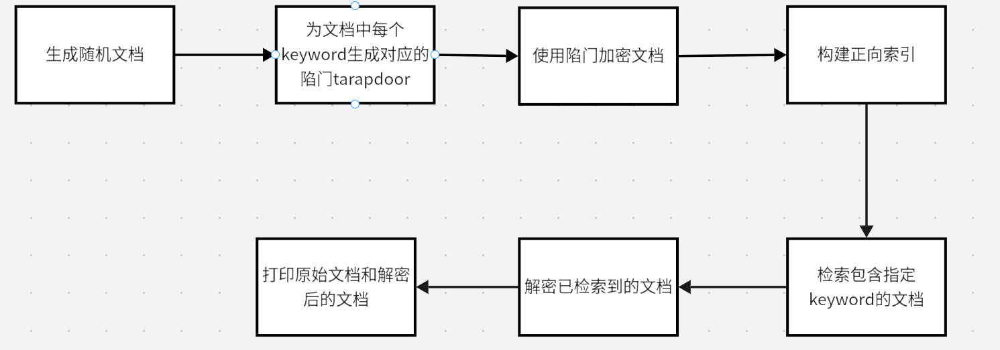
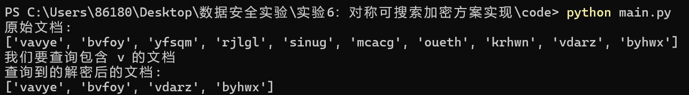
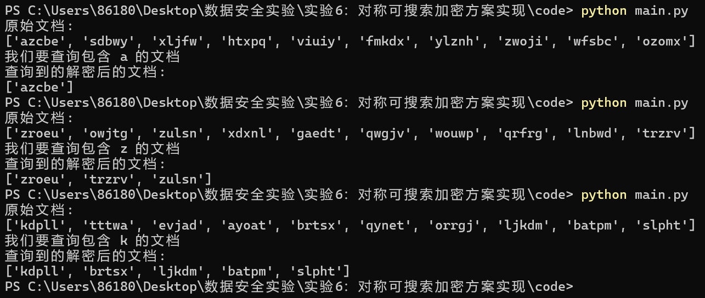

# 实验六：对称可搜索加密方案实现


#### 姓名：于成俊

#### 学号：2112066

#### 专业：密码科学与技术


## 一、实验内容

根据正向索引或者倒排索引机制，提供一种可搜索加密方案的模拟实现，应能分别完成加密、陷门生成、检索和解密四个过程。


## 二、实验原理

### 1.介绍

- **可搜索加密**可分为4个子过程

  (1) 加密过程：用户使用密钥在本地对明文文件进行加密并将其上传至服务器；

  (2) 陷门生成过程：具备检索能力的用户使用密钥生成待查询关键词的陷门（也可以称为令牌），要求陷门不能泄露关键词的任何信息；

  (3) 检索过程：服务器以关键词陷门为输入，执行检索算法，返回所有包含该陷门对应关键词的密文文件，要求服务器除了能知道密文文件是否包含某个特定关键词外，无法获得更多信息；

  (4) 解密过程：用户使用密钥解密服务器返回的密文文件，获得查询结果。

- **对称可搜索加密** (Symmetric searchable encryption, SSE)：旨在加解密过程中采用相同的密钥之外，陷门生成也需要密钥的参与，通常适用于单用户模型，具有计算开销小、算法简单、速度快的特点。 


### 2.具体步骤

借鉴 Dawn Song 所提出的 SWP 方案，**基于正向索引**来实现：

- 加密过程：

  (1) 使用分组密码 E 逐个加密明文文件单词

  (2) 对分组密码输出$E(K',W_i)$进行处理

  (3) 异或$E(K',W_i)$和$ S_i||F(K_i, S_i) $以形成$W_i$的密文单词。

- 查询过程（查询文件 D 中是否包含关键词 W）

  (1) 发送陷门$T_W=(E(K',W),K=f(K'',L))$至服务器

  (2) 服务器顺序遍历密文文件的所有单词$C$，计算$ C \, XOR\, E(K',W)=S||T$，判断$ F(K,S)$

  是否等于$T$

  (3) 如果相等，$C$ 即为$W$在$D$中的密文；否则，继续计算下一个密文单词。


### 3.实验流程

流程图如下：




## 三、实验环境

- 系统：Windows 11
- 语言：python 3.7


## 四、实验过程

根据上面的实验流程图来编写代码

### （1）生成陷门

在保护明文信息不被泄露的前提下，我们可以允许授权用户通过输入特定的搜索陷门来搜索加密数据。一种常见的实现方式是利用伪随机函数（PRF）进行生成。具体而言，我们可以将一个密钥和一个随机数作为PRF的输入，然后将PRF的输出作为搜索陷门。这样一来，只有掌握密钥的用户才能生成正确的搜索陷门，从而实现对加密数据的搜索。这种方法既保证了数据的安全性，又提高了搜索的效率。

代码如下：

```python
# 将已有的keyword生成对应的hash值
def generate_hash(keyword):
    # 使用SHA256算法对keyword进行哈希
    hash_object = hashlib.sha256(keyword.encode())
    # 返回哈希值的十六进制表示
    return hash_object.hexdigest()

# 为已有的keyword生成对应的陷门trapdoor
def generate_trapdoor(keyword):
    # 初始化陷门列表
    trapdoor = []
    # 对keyword中的每个字符进行哈希，并将哈希值的第一个字符添加到陷门列表中
    for i in range(len(keyword)):
        trapdoor.append(generate_hash(keyword[i])[0])
    # 返回陷门列表
    return trapdoor
```


### （2）加密和解密

- encrypt_document()函数：

  ```python
  # 加密文档
  def encrypt_document(document, trapdoors):
      # 初始化加密文档列表
      encrypted_document = []
      # 遍历文档中的每个单词
      for i in range(len(document)):
          # 初始化加密单词列表
          encrypted_word = []
          # 遍历单词中的每个字符
          for j in range(len(document[i])):
              # 使用陷门对字符进行加密，然后将加密后的字符添加到加密单词列表中
              encrypted_char = chr(ord(document[i][j]) + ord(trapdoors[i][j % len(trapdoors[i])]))
              encrypted_word.append(encrypted_char)
          # 将加密单词添加到加密文档列表中
          encrypted_document.append(''.join(encrypted_word))
      # 返回加密文档
      return encrypted_document
  ```

  - 输入：
    - `document`：一个列表，其中每个元素是一个字符串（代表文档中的一个单词）。
    - `trapdoors`：一个与`document`结构类似的列表，其中每个元素是一个字符串（代表对应的加密“陷门”）。

  - 过程：
    - 遍历`document`中的每个单词。
    - 对于每个单词中的字符，通过将该字符的ASCII值加上对应“陷门”字符的ASCII值来加密它。
    - 加密后的字符被收集到一个新列表中，并最终连接成一个加密后的单词。
    - 所有加密后的单词被收集到一个列表中，形成加密后的文档。

  - 输出：
    - 返回加密后的文档，它是一个由加密后单词组成的列表。

- decrypt_document()函数

  ```python
  # 解密文件
  def decrypt_document(document, trapdoors):
      # 初始化解密文档列表
      decrypted_document = []
      # 遍历文档中的每个单词
      for i in range(len(document)):
          # 初始化解密单词列表
          decrypted_word = []
          # 遍历单词中的每个字符
          for j in range(len(document[i])):
              # 使用陷门对字符进行解密，然后将解密后的字符添加到解密单词列表中
              decrypted_char = chr(ord(document[i][j]) - ord(trapdoors[i][j % len(trapdoors[i])]))
              decrypted_word.append(decrypted_char)
          # 将解密单词添加到解密文档列表中
          decrypted_document.append(''.join(decrypted_word))
      # 返回解密文档
      return decrypted_document
  ```

  - 输入：
    - `document`：一个列表，其中每个元素是一个字符串（代表已加密文档中的一个单词）。
    - `trapdoors`：与加密时相同的“陷门”列表，用于解密。

  - 过程：
    - 遍历`document`中的每个已加密单词。
    - 对于每个已加密单词中的字符，通过将该字符的ASCII值减去对应“陷门”字符的ASCII值来解密它。
    - 解密后的字符被收集到一个新列表中，并最终连接成一个解密后的单词。
    - 所有解密后的单词被收集到一个列表中，形成解密后的文档。

  - 输出：
    - 返回解密后的文档，它是一个由解密后单词组成的列表。

**注意**：

- 由于加密和解密都使用了相同的“陷门”列表，因此这个系统是对称的。
- 如果`trapdoors`列表在加密和解密过程中不一致，或者如果文档在传输过程中被篡改，解密将不会成功，或者将产生乱码。


### （3）正向索引

在可搜索加密方案中，构建正向索引是一项关键步骤。它能够将明文数据转化为可搜索的索引结构，从而实现对加密数据的高效搜索。首先，我们需要对明文数据进行预处理，将原始的文本数据分解为独立的词项。在实际场景中，我们还需要统计每个词项在文本中的出现次数，以便得到一个包含词项集合和相应词频信息的结构。然而，在这里，我们并不需要这样做。接下来，我们可以通过编码将每个词项映射为一个唯一的整数，以便进行后续的索引操作。这样，我们就可以得到一个有序的词项集合和相应的编码信息。最后，我们可以遍历每个文档，将文档编号和对应的词项集合存储到正向索引中。这样，我们就得到了一个包含所有文档和对应词项集合的正向索引。这是一个简洁而有效的方法，可以大大提高我们处理加密数据的效率。

代码如下：

```python
# 通过已有的keyword查询正向索引，返回包含该keyword的文档
def retrieve_documents(keyword, index):
    # 初始化文档列表
    documents = []
    # 遍历关键词中的每个字符
    for char in keyword:
        # 如果字符在索引中，将索引中对应的文档添加到文档列表中
        if char in index:
            documents.append(set(index[char]))
    # 如果文档列表为空，返回空列表
    if len(documents) == 0:
        return []
    else:
        # 否则，返回文档列表中的交集，即包含所有关键词字符的文档
        return list(set.intersection(*documents))
```

​              


### （4）生成随机定长字符串

为了方便测试，定义了generate_random_string函数来生成给定长度的小写字母随机字符串:

```python
# 定义一个函数，用于生成随机定长字符串
def generate_random_string(length):
    # string.ascii_lowercase包含所有小写字母
    letters = string.ascii_lowercase
    # 使用random.choice从letters中随机选择一个字母，重复length次
    # ''.join将选择的字母连接成一个字符串
    return ''.join(random.choice(letters) for i in range(length))
```


### （5）main函数

代码如下：

```python
# 主函数，包含了测试样例和接口调用
if __name__ == "__main__":
    # 步骤一，生成随机文档
    document = []
    for i in range(10):
        document.append(generate_random_string(5))  # 生成长度为5的随机字符串

    # 步骤二，为文档之中每个keyword生成对应的陷门trapdoor
    trapdoors = []
    for i in range(len(document)):
        trapdoors.append(generate_trapdoor(document[i]))  # 为每个关键词生成对应的陷门

    # 步骤三，使用陷门加密文档
    encrypted_document = encrypt_document(document, trapdoors)  # 使用陷门对文档进行加密

    # 步骤四，构建正向索引
    index = {}
    for i in range(len(encrypted_document)):
        for j in range(len(encrypted_document[i])):
            keyword = encrypted_document[i][j]
            if keyword not in index:
                index[keyword] = []  # 如果索引中没有这个关键词，就新建一个空列表
            index[keyword].append(i)  # 将文档的索引添加到关键词对应的列表中

    # 步骤五，检索包含指定keyword的文档
    query = encrypted_document[0][0]  # 查询的关键词
    retrieved_documents = retrieve_documents(query, index)  # 检索包含查询关键词的文档

    # 步骤六，解密已检索到的文档
    decrypted_documents = []
    for i in range(len(retrieved_documents)):
        decrypted_documents.append(decrypt_document([encrypted_document[retrieved_documents[i]]], [trapdoors[retrieved_documents[i]]])[0])  # 解密检索到的文档

    # 步骤七，打印原始文档和解密后的文档
    print("原始文档:")
    print(document)
    print("我们要查询包含 %s 的文档" % decrypt_document(query, trapdoors[0][0])[0])  # 打印查询的关键词
    print("查询到的解密后的文档:")
    print(decrypted_documents)  # 打印解密后的文档
```

主函数流程图如下：




至此，代码全部编写完成！

## 五、实验结果

- 使用`python main.py`命令进行运行：

  

  可以看到，我们的 keyword 是字母 v，这就是**关键词** **W**，然后**原始文档** **D** 是最开始打印出来的 List，而**单词** **C** 则是针对每一个单词，对每一个字母进行加密后的结果。这时，只需要使用陷门进行查询，即可得到最后的结果。最后，展示了包含字母 v 的结果。

- 进行多次实验：

  

  可以看出，结果都是正确的！

​       

## 六、实验总结

这次对称可搜索加密方案的实现实验让我收获颇丰。我不仅深入了解了SSE方案的基本原理和算法，还通过实践掌握了相关的编程技术和调试方法。在未来的学习和研究中，我将继续关注SSE领域的发展动态和最新成果，努力提高自己的专业水平和能力。同时，我也希望能够与更多的同行进行交流和合作，共同推动SSE技术的发展和应用。

​              

​              