# Private, Efficient, and Accurate: Protecting Models Trained by Multi-party Learning with Differential Privacy

## 一、引言

自欧盟发布《通用数据保护条例》（GDPR）以来，数据传输受到了比以往更严格的限制。为了在隐私保护的前提下利用存储在不同方的数据，MPL成为一种重要技术。多方学习（Multi-party Learning，简称MPL）是一种基于安全多方计算（Secure Multi-party Computation，简称SMPC）的机器学习技术，可以在不泄露各方私密信息的情况下，利用多方数据进行模型训练。

受益于SMPC提供的严格的安全保障，通过使用MPL，数据分析师可以基于多个来源的数据训练机器学习模型，除了训练好的模型，不会泄露任何私人信息。

然而，近年来提出了许多针对机器学习模型本身的攻击，例如成员推理攻击。这些攻击只需要访问训练好的模型（即没有原始数据，甚至没有中间结果）。例如，通过使用成员推理攻击，攻击者可以通过查询目标模型来推断一个数据点的成员资格。由于这些攻击被SMPC的威胁模型所遗漏，它们将严重破坏MPL框架的安全性。

差分隐私（简称DP）是一种广泛使用的技术，以严格的隐私保证来防御上述攻击，这与目前启发式方法提供的保护不同。同时，最近的一项用户研究表明，当提供严格的隐私保证时，用户更愿意分享他们的数据。因此，DP可能是一个比现有启发式防御更重要的防御。然而，DP的噪音会导致训练过的模型出现明显的精度损失，特别是对于深度神经网络模型。此外，还有很多关于MPL效率优化的研究，但明文训练和安全训练之间仍然存在巨大的效率差距。因此，在MPL的安全训练中，如何平衡隐私、效率和准确度之间的3种权衡是非常具有挑战性的。具体来说：
（1）直接结合各方的明文数据来有效地训练一个准确的模型会带来严重的隐私问题；
（2）用现有的MPL框架训练一个准确的模型可以部分地保护隐私，但它需要大量的时间来完成训练过程；
（3）虽然将DP整合到MPL框架中而不进一步优化可以解决隐私问题，但DP导致的精度损失会抵消结合多方数据的精度增益。

在本文中，作者通过提出一个被称为PEA（Private, Efficient, Accurate）的解决方案来推动解决上述问题，该方案由一个安全的差分私有随机梯度下降（简称DPSGD）协议和两个优化方法组成。首先，通过设计一个安全的平方根逆协议，在基于秘密共享的MPL框架中执行DPSGD算法, 以加强其隐私保护。其次，为了减少DP导致的精度损失，提高MPL的效率，作者提出了两种优化方法：
（1）用与数据无关的特征提取器提取输入数据的特征；
（2）通过聚合各方的本地数据训练的本地模型来初始化全局模型。

通过第一种优化方法，各方只需要在提取的特征上安全地训练一个差异化的私有简单模型，就可以实现类似的、甚至比差异化的私有复杂模型有更高的准确率，如有几十层的Resnet，在原始数据上的训练，精度更高。此外，第二种优化方法为安全训练过程初始化了一个相对准确的全局模型，从而大大加快了模型训练过程的收敛速度。

## 二、PEA

下图介绍了PEA的概况，它在SMPC协议的支持下在训练过程中发挥作用。

### 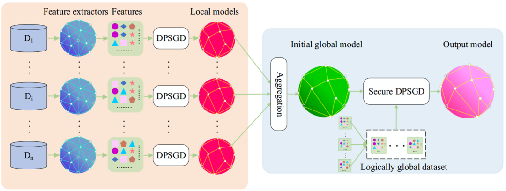

接下来，我将介绍本篇论文提出的协议和优化方法的动机和设计。

### （1）安全的DPSGD协议

在多方设置中，本地差分隐私不依赖于受信任的服务器，这是一种保护隐私的直接方法。然而，本地差分隐私造成的准确性损失比中央DP造成的损失大一个或多个数量级，后者需要一个受信任的服务器来处理所有数据。受益于SMPC协议提供的安全保证，即使在多方设置中，MPL也可以模拟一个可信的服务器，对来自分布式各方的所有数据进行模型训练。

根据上述分析，在多方设置中利用DPSGD算法来保护由MPL框架训练的模型。DPSGD在梯度向量中加入了从高斯分布中采样的噪声，并以有界的$L_2$规范来保护训练数据。因此，作者设计了一个基于秘密共享的平方根逆协议来剪辑梯度向量的$L_2$规范，并利用Dwork等人提出的分布式噪声生成协议来安全地生成随机高斯噪声。

### （2）效率和准确性的优化方法

现有的MPL框架试图安全地训练端到端的深度神经网络模型（即训练结合特征提取和分类的神经网络模型）。然而，将DP与深度神经网络模型相结合可能会导致显著的准确性损失。此外，在当前SMPC协议的计算和通信复杂性下，安全地训练一个端到端的深度神经网络模型是很困难的，甚至是不切实际的。因此，可以让每一方首先应用与数据无关的特征提取器，包括基础模型（例如BERT）和特征提取规则，在本地提取输入数据集的特征。然后在提取的特征上协同训练浅层模型（如线性模型或有几层的神经网络模型）。这样一来，各方只需要在浅层模型训练过程中进行安全计算和添加噪音。精度损失和通信开销可以大大减少。

此外，当训练一个机器学习模型时，从一个准确的初始模型开始会大大改善收敛速度。作者的主要想法是让每一方用DPSGD在他或她的本地数据上训练一个本地模型。随后，各方用SMPC协议安全地汇总他们的本地模型，以初始化一个全局模型。通过在本地执行训练过程中的部分计算，各方可以显著提高MPL的效率。

## 三、安全的DPSGD

在本节中，我将首先介绍平方根逆协议和安全高斯噪声生成协议，然后结合这两个协议来讲论文是如何设计安全的 DPSGD 协议。

### （1）平方根逆协议

为了裁剪一个梯度向量$g$的$𝐿_2$范数，各方需要计算$||g||_2$的倒数，即：$\frac{1}{\sqrt(g_1^2+g_2^2+...+g_p^2)}$。由于此计算涉及平方根和除法两个函数，它们都是非线性的，因此直接使用秘密共享协议实现它们意味着巨大的通信开销。为了减少开销，一种可行的方法是使用多项式来逼近非线性函数。将原始秘密值$<x>_i$转换为$<x'*2^{exp}>_i (0.25<x'\leq 0.5)$。之后，分别计算$<\frac{1}{\sqrt{x'}}>_i$与$<2^{-\frac{exp}{2}}>_i$。最后二者相乘得到$<\frac{1}{\sqrt{x}}>_i$。但这种方法用在此处会出现问题：近似就会存在误差，使用多项式逼近所带来的误差可能会破坏 DP 的隐私保证。如果真值$(\frac{C}{||\nabla \ell(\theta;s_i) ||_2})$略小于1(即：$||\nabla \ell(\theta;s_i) ||_2 >C$)，而近似值$(\frac{C}{||\nabla \ell(\theta;s_i) ||_2})$略大于1(即：$||\nabla \ell(\theta;s_i) ||_2 <C$)，根据算法，梯度向量不会被裁剪，其$L_2$范数会超过$C$。因此，DP的隐私保证被破坏。最后，为了解决上述问题，作者提出了基于线性秘密共享协议的平方根逆协议，并证明了近似多项式的误差界，以保持DP的严格隐私保证。

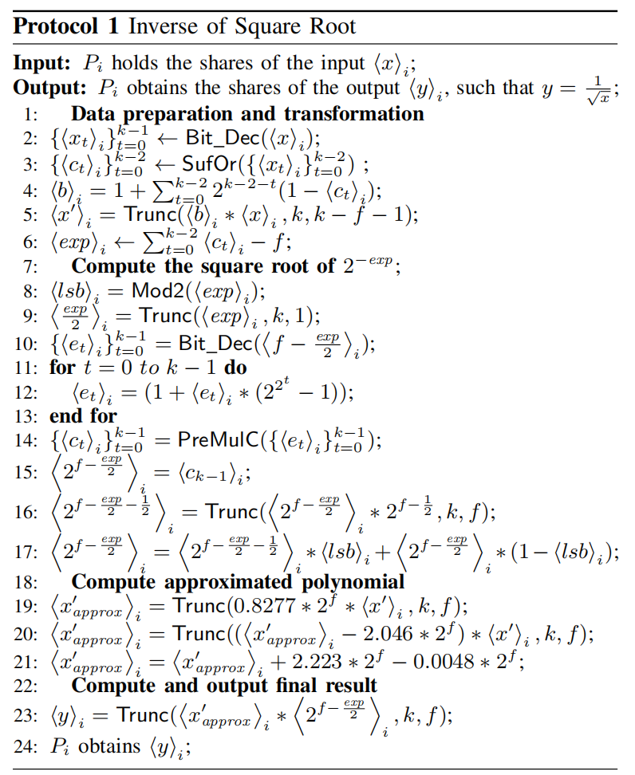

### （2）安全高斯噪声生成协议

作者参考了 Dwork 等人提出的分布式噪声生成协议。安全地生成均值为 0 且标准差为 σ 的高斯噪声。细节显示在协议2中。

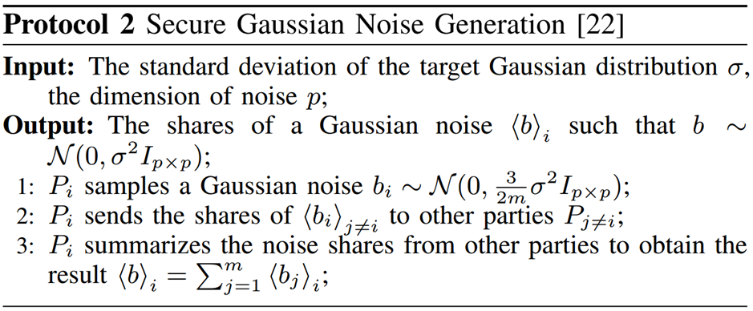

受益于高斯分布的可加性，来自各方的独立高斯噪声的总和是目标高斯噪声。每一方都会生成方差为$\frac{3}{2m}\sigma^2 I_{p×p}$的高斯噪声，以保持协议的拜占庭鲁棒性。拜占庭鲁棒性意味着如果不超过 1/3 的参与方失败，参与方可以产生足够随机的噪声。各方通过调用协议协作生成具有预定义标准偏差 $σ$ 的高斯噪声，并将它们应用于扰动梯度向量。

请注意，这不是端到端安全 $DPSGD$ 协议的属性。并且，由于噪声产生过程只需要安全相加，其安全性得到了微不足道的保证。

至于通信复杂度，协议2可以在$O(mpk)$位消息传输的一轮通信中完成。此外，由于噪声生成过程与数据无关，可以离线生成，所以它对在线训练过程的效率没有影响。

### （3）安全DPSGD协议

通过协议 1 和协议 2，随后引入了安全的 DPSGD 协议，如协议 3 所示。首先，各方安全地计算梯度向量。其次，各方通过使用 协议1 计算梯度向量的$L_2$范数的逆并将它们与 1之间的比较结果 存储在 is_clip 中来裁剪梯度向量的$L_2$范数。之后，各方根据 is_clip 的值更新梯度向量。随后，各方通过调用协议 2 协作生成具有预定义标准偏差 $σ$ 的高斯噪声，并将它们应用于扰动梯度向量。最后，各方按照常规梯度下降过程更新模型参数 $θ$。请注意，模型参数在整个安全 DPSGD 过程中以秘密共享形式保存。

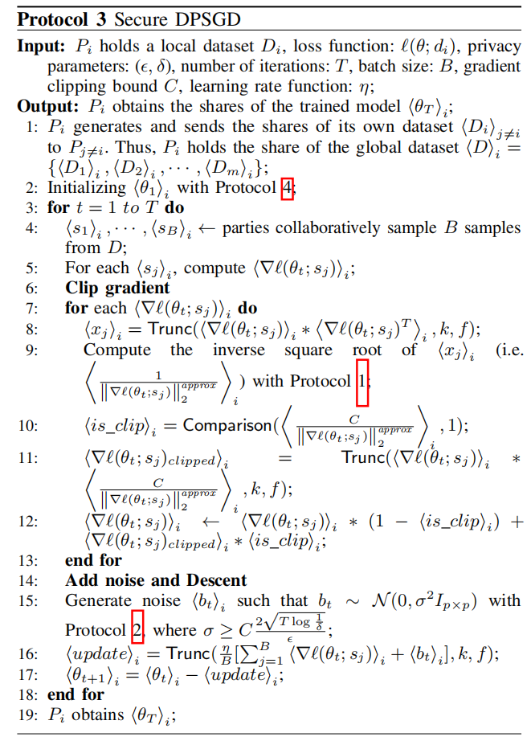

## 四、训练过程的优化方法

在本节中，我将介绍两种优化 MPL 准确性和效率的方法，即与数据无关的特征提取方法和基于局部数据的全局模型初始化方法，优化方法的核心思想是简化训练模型的结构并在本地完成部分计算，从而减少训练过程中添加的随机噪声和训练过程所需的安全计算。最后，再讲一下如何组合成PEA。

### （1）与数据无关的特征提取方法

在 MPL 中简化训练模型有两个方面的原因：

1. 一方面，从DP的角度来看，深度神经网络模型结构复杂，需要在训练过程中加入大量的随机噪声，从而造成较大的精度损失。首先，深度神经网络模型的梯度向量主要是高维的。在 DPSGD 中，随着随机噪声被添加到每个梯度向量分量中，具有更高维度的梯度向量需要更多的噪声。Bassily等人从理论上证明，DPSGD 意味着梯度向量维度下限线性的额外损失。其次，深度神经网络模型有很多冗余参数。因此，向这些冗余参数添加噪声会对神经网络模型造成额外的精度损失。Yu等人表明，尽管在少量公共数据的帮助下优化了原始 DPSGD，但对于 CIFAR-10数据集，差异私有和非私有深度神经网络模型之间的精度差距仍然保持在 15% 以上。

2. 另一方面，从SMPC的角度来看，深度神经网络模型的表示能力是以效率为代价的，即深度神经网络模型有很多冗余参数来拟合数据。学习这些参数需要大量的计算。例如，在 ImageNet-1k 数据集上训练一个流行的深度神经网络模型 ResNet-50 模型需要大约 $10^{18}$ 次单精度操作。在集中式设置中，可以使用特定领域的处理器（例如 GPU）和分布式计算技术来加速训练过程。然而，在使用MPL训练深度神经网络模型时，SMPC协议带来的巨大通信开销会成为性能瓶颈。在线性秘密共享协议中，要完成一次不动点数乘法，需要各方交换消息。因此，在高维数据上训练深度神经网络模型不可避免地意味着巨大的通信开销。综上所述，利用当前的秘密共享协议和差分隐私优化算法，安全地训练准确且差分隐私的端到端深度神经网络模型仍然是不切实际的。

为了同时安全地训练精度损失小且效率高的差分隐私模型，作者让每一方首先应用数据无关的特征提取器，包括公共基础模型和启发式特征提取规则，以提取输入数据的高级特征。之后，各方在提取的特征上训练浅层模型（例如线性模型或浅层神经网络模型）。

近年来，基于基础模型的训练模型，即在大规模公共数据上预训练的深度神经网络模型，迅速成为人工智能的新范式。在情报领域，利用从大规模公共数据中转移的知识，基础模型可以有效地提取来自各个领域的输入数据的高级特征。因此，在提取的特征上训练的模型可以非常准确。经典的特征提取规则也证明了它们在各种任务中的有效性，也分析了上述方法是如何减少DP带来的精度损失并提高MPL的效率。

由于基础模型和特征提取规则都是数据无关的，因此各方只需在浅层模型训练过程中添加噪声即可。最近的研究表明，可以应用 DP 私下训练精度损失小的浅层模型。因此，在提取的特征上训练模型可以显著减少 DP 带来的精度损失。此外，由于特征提取是在本地对明文数据进行的，因此各方只需对秘密共享形式的数据进行浅层模型训练，从而可以显著减少安全计算的数量。总之，使用与数据无关的特征提取器提取特征使各方能够减少安全训练差分私有端到端深度神经网络模型的大量准确性损失和巨大的通信开销。

并且，数据无关特征提取方法有DP保证。因为对秘密共享数据执行全局模型训练过程，所以提取的特征对潜在对手（即其他方，训练模型的用户）是不可见的。同时，由于利用安全的 DPSGD 来保护经过训练的模型，因此特征提取操作不会被对手察觉。换句话说，与数据无关的特征提取可以看作是与数据无关的数据预处理步骤，例如将数据样本的特征加1。因此，没有必要在数据无关的特征提取过程中加入随机噪声。

### （2）基于局部数据的全局模型初始化方法

在此，我将介绍如何聚合来自各方的局部模型来初始化全局模型，即如何利用各方持有的本地数据来初始化一个准确的全局模型将显著减少全局模型训练过程中的迭代次数，从而提高 MPL 的效率。聚合方法参考联邦学习领域中的经典聚合方法，考虑到训练数据在各方之间可能不是独立同分布（简称Non-IID），作者提出了两种聚合局部模型的方法：

1、平均策略：将局部模型参数平均作为初始全局模型的参数。这种方法起源于联邦学习的文献。

2、准确性策略：当数据是 Non-IID 时，通过平均局部模型来初始化全局模型可能会导致初始全局模型的精度低于局部模型。

通过上述聚合方法，作者在协议 4 中展示了全局模型初始化方法。由于数据的分布状态难以直接衡量，通过选择不同聚合方法生成的最准确的候选模型来选择初始全局模型。作者在协议 4 的第 4-11 行中展示了初始全局模型选择方法的详细信息。各方使用不同的聚合方法生成候选模型，并分别评估每个候选模型的准确性。最后，各方通过比较候选模型的准确率，得到最准确的初始全局模型。

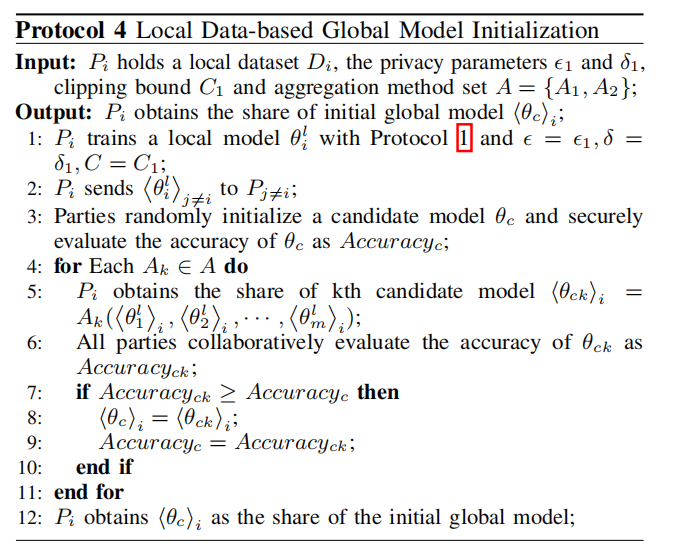

受益于 DP  的后处理免疫特性，分析全局模型的隐私保证，只需要分析局部模型训练阶段的隐私保证。

### （3）把所有组合在一起：PEA

结合安全 DPSGD 协议和上述两种优化方法，便可得到协议 5 中所示的 PEA

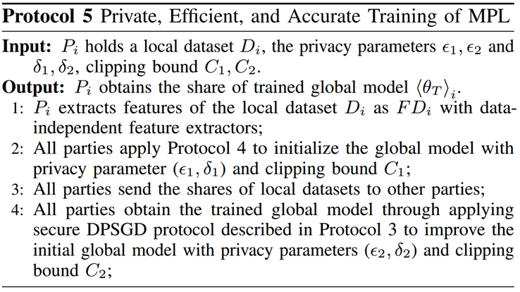

每一方首先使用与数据无关的特征提取器提取他或她的输入数据集的特征（注意，这一步是在本地完成的），并对提取的特征执行以下训练过程。接下来，他们通过使用协议 4 中介绍的方法协作初始化全局模型。最后，各方使用安全 DPSGD 协议在逻辑全局数据集上改进全局模型。

## 五、实验结论

在本节中，我先进行端到端比较来说明 PEA 的有效性，然后评估平方根倒数协议的运行时间和近似误差，之后，评估优化方法的有效性并比较不同聚合方法的性能。随后，将 PEA 与两种最先进的联邦学习方法和 DP 安全聚合进行比较。最后，评估 MPL 训练的模型的准确性，以表明 MPL 可以显著提高差分隐私模型的准确性。

### （1） 实验设置

  作者在两个开源 MPL 框架中实现 PEA：$TF-Encrypted$和 $Queqiao$。$TF-Encrypted$ 使用 Python 实现，包含多个后端 SMPC 协议。作者基于其支持的 ABY3后端协议实施 PEA。由于 ABY3 是在整数环而不是素数域上设计的，作者通过将 ABY3 的一些原语与其他协议相结合来实现$TF-Encrypte_{\epsilon}$中协议 1 中涉及的一些原语。例如，通过结合 A2B 协议和 Knott 等人提出的共享转换协议来实现 Bit Dec。作者在$Queqiao_{\epsilon}$中将环大小设置为 264，将定点数 f 的小数部分的位数设置为 20。

  作者实验中涉及的三个广泛使用的数据集分别为：

1. MNIST  是一个手写数字数据集，广泛用于评估多方学习研究。MNIST 包含 60,000 个训练样本和 10,000 个测试样本。每个数据样本代表 0 到 9 之间的一个数字，具有 28 × 28 个灰色像素。

2. CIFAR-10 包含 60,000 张 32 × 32 RGB 图像，分为十个类别，每个类别有 6,000 张图像。因此，随机抽取 50,000 张图像作为训练数据集，其余 10,000 张图像作为测试数据集。

3. IMDb  是自然语言处理领域的一个流行数据集。它包含来自 IMDb 的 50,000 条电影评论以及 25,000 个训练样本和 25,000 个测试样本。IMDb 的二元标签表示电影评论的情绪（即正面或负面）。

### （2）端到端比较

作者采用在原始数据集上训练的几种流行的差分私有深度神经网络模型作为基线。对于 MNIST 和 CIFAR-10，分别训练了差分隐私 LeNet 模型 和 VGG-16 模型 。这两个模型的非私有训练也得到了 CryptGPU  和 Falcon  的支持。对于 IMDb，作者训练了 Bu 等人使用的相同的差分隐私神经网络模型作为基线。作者将其称为 SampleNet。在基线训练期间将 $\sigma$ 和高斯分布的噪声乘数设置为与PEA相同的值。然后随着迭代次数的增加调整 ε 。所有基线模型均由 Yousefpour 等人发布的 Opacus 框架训练。结果如下：

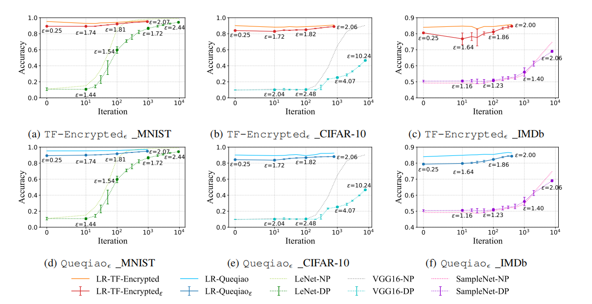

可以看出，在相同的迭代次数下，训练的差分隐私逻辑回归模型在所有三个数据集中都比差分隐私深度神经网络模型具有更高的准确率。请注意，在不同数据集上训练的基线模型具有不同的隐私预算，因为作者为它们设置了不同的批量大小。

### （3）协议 1 的效率和近似误差

作者将协议 1 的效率和准确性与 Facebook 发布的 MPL 框架 CrypTen  进行了比较。由于 CrypTen 不能直接计算平方根的倒数，作者通过顺序调用 CrypTen 的 sqrt() 和 reciprocal() API 来实现它。请注意，在3方场景下运行所有三个框架，并在这里比较所有 MPL 框架的在线运行时间。结果如下：

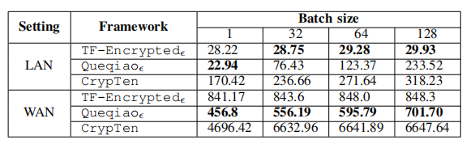

1、协议 1 的效率：作者在上表中显示了运行时间比较结果。在所有批量大小下，$TF-Encrypte_{\epsilon}$和$Queqiao_{\epsilon}$在 LAN 和 WAN 设置中都比 $CrypTen$ 更有效。这是因为作者使用多项式直接逼近目标函数，只需要不断的通信轮次。相比之下，$CrypTen$ 使用 $Newton-Raphson$ 方法迭代逼近目标函数，因此需要更多的通信开销。此外，在局域网设置下，$TF-Encrypte_{\epsilon}$和 $CrypTen$ 的运行时间随着 batch size 的增加变化不大。主要原因是这两个框架建立在 $TensorFlow$ 和$Pytorch$ 之上，它们都支持高效的向量化计算。而在 WAN 设置中，通信轮数是效率的主导因素，$Queqiao_{\epsilon}$的运行时间是最短的，因为它具有最少的通信轮数。请注意，作者通过组合多个协议来实现$TF-Encrypte_{\epsilon}$中协议 1 中涉及的部分原语。因此它比$Queqiao_{\epsilon}$有更多的通信轮次。

2、协议 1 的近似误差：在下图中展示了三个框架的近似误差，该误差是通过近似结果减去精确结果计算得出的。与仅在输入值大于 0.1 且小于 200 时才准确的 $CrypTen$ 相比，$TF-Encrypte_{\epsilon}$和$Queqiao_{\epsilon}$的近似误差随着输入值从 0.01 变为 300 而稳定保持较小。$CrypTen$ 对于部分输入值有如此大的误差，是因为它使用了 $Newton-Raphson$ 方法来逼近目标函数。它的近似误差高度依赖于预定义的初始点和迭代次数。因此，对于固定范围内的那些输入值，$CrypTen$ 可能是准确的，而对于其他输入值则有很大的误差。此外，$TF-Encrypte_{\epsilon}$和$Queqiao_{\epsilon}$的近似误差都小于 0。

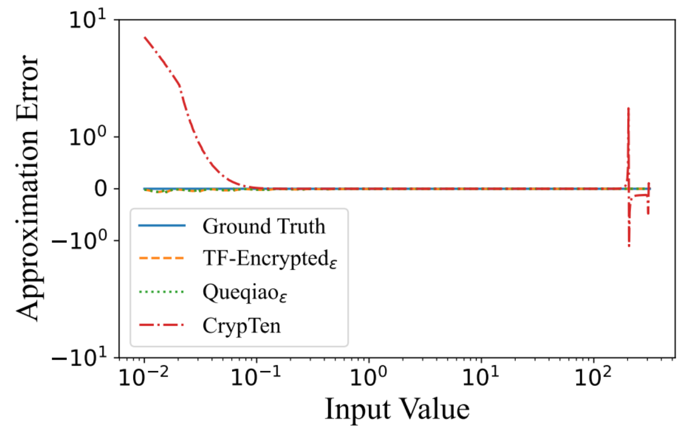

### （4）优化的有效性

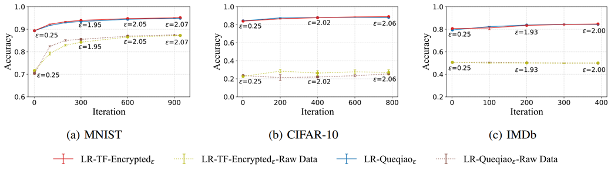

1、特征提取的有效性：作者保持其他实验设置不变，并分别比较在提取的特征和原始数据上训练的差异隐私模型的准确性。对于 MNIST 和 CIFAR-10，直接使用它们的像素矩阵作为训练数据。对于 IMDb，使用 BertTokenizerFast 工具 7 对其文本数据执行标记化，以生成表示为矩阵的训练数据。上图展示了实验结果。与在原始数据上训练的差分隐私模型相比，在提取的特征上训练的模型可以获得更高的准确性。对于三个数据集中维度最高 (3,072) 的 CIFAR-10，在提取特征和原始数据上训练的模型之间的准确率差距高于 60%。对于具有丰富语义的 IMDb，在原始数据上训练的模型几乎是完全随机的。上述结果表明，使用与数据无关的特征提取器提取输入数据的特征可以显著提高分类模型的准确性。

2、使用本地数据进行全局模型初始化的有效性：为了设置基线，作者使用从高斯分布中采样的随机变量来初始化全局模型，这是机器学习领域的标准初始化方法。将高斯分布的均值和标准差设置为 0 和 0.2。至于隐私参数设置，将 $\epsilon$ 设置为局部训练阶段使用的$\epsilon_1$和全局训练阶段使用的$\epsilon_2$之和，$δ$ 为$\frac{1}{10n}$。下图展示了实验结果。

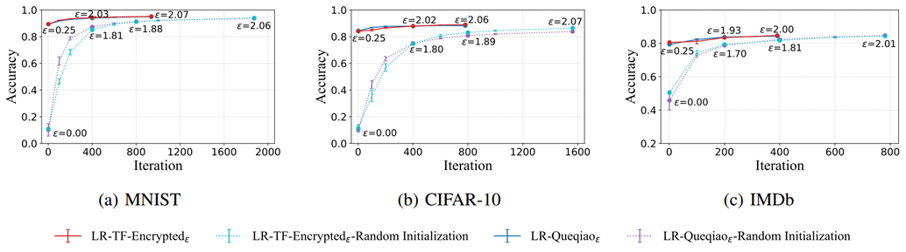

实验结果证明了作者提出的使用局部数据方法初始化全局模型的有效性。当从一个随机初始化的全局模型开始训练时，即使经过两次迭代，训练后的模型的准确性仍然小于从使用局部数据初始化的模型训练的模型。因此，通过在本地消耗部分隐私预算，可以显著减少全局模型训练阶段的安全计算次数，提高模型训练过程的效率。

### （5）聚合方法的比较

作者比较了平均局部模型和选择最准确的模型初始化的全局模型的准确性。作者考虑两种情况：独立同分布和非独立同分布。将整个数据集随机分为三个部分来模拟 IID 场景。对于 Non-IID 场景，根据之前的研究，首先将整个数据集按标签值排序，然后将它们分为三部分。划分数据集后，使用不同的方法对其进行聚合。

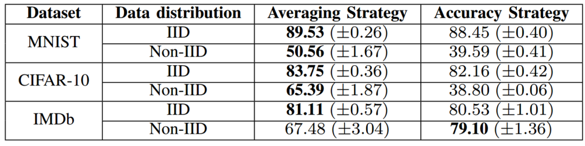

上表显示了精度比较结果。在 IID 场景中，平均局部模型的性能略高于选择最准确的局部模型。相比之下，在 Non-IID 场景下，这两种聚合方法在不同的数据集上有不同的表现。对于 MNIST 和 CIFAR-10，通过平均局部模型初始化的全局模型比通过选择最准确的局部模型初始化的模型准确得多。而对于 IMDb，通过选择最准确的局部模型初始化的全局模型比通过平均局部模型参数初始化的模型准确得多。当通过比较协议 4 中候选模型的准确性来选择最佳聚合方法时，可以为不同的场景初始化一个准确的全局模型。

## 六、总结

本文提出的PEA可以帮助基于秘密共享的MPL框架在较少精度损失的情况下，安全、高效地训练差分隐私机器学习模型。在两个开源MPL框架（TF-Encrypted和Queqiao）上的实现和实验表明，PEA在效率和效果上表现优异。根据实验结果可以看出，通过PEA，多个方可以在MPL的模型训练过程中平衡隐私、效率和准确性之间的三方权衡。